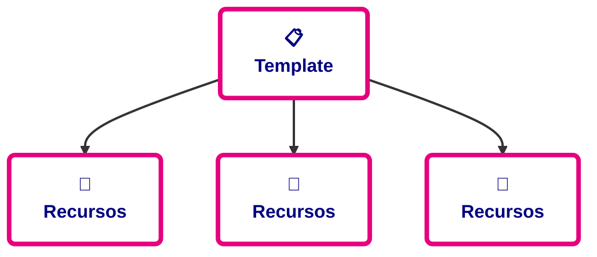
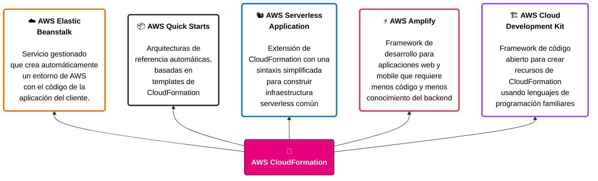

# Automatización de infraestructura

> Esta clase abarca el módulo 11 del curso de AWS Cloud Architecting

## Objetivos

- Reconocer cuándo y por qué se utiliza la automatización de arquitectura.
- Identificar cómo se usa la infraestructura como código (IaC) para crear y administrar recursos de nube.
- Identificar cómo modelar, crear y gestionar una colección de recursos usando AWS CloudFormation.
- Comprender cómo usar templates de AWS Quick Start CloudFormation para definir una arquitectura.
- Reconocer los usos de Amazon Q Developer.
- Aplicar los principios del AWS Well-Architected Framework al diseño de estrategias de automatización.

## Automatización de la arquitectura
Si no automatizamos la creación de infraestructura y sabemos que es un proceso manual que vamos a tener que repetir, podemos caer en uno o más de los siguientes problemas:
- No poder reproducirlo a escala
- No poder versionarlo, dado que lo hacemos de manera manual
- No tener registro de auditoría
- Tener configuraciones inconsistentes

Justamente, el poder automatizar la infraestructura/arquitectura viene a resolver todo lo anterior. Para eso, AWS ofrece sus propias herramientas, tales como IaC y otras que veremos más adelante

## Infraestructura como código
IaC es el proceso de escribir un template que crea y mantiene recursos de nube.



Lo bueno es que es legible para las personas, porque lo seteamos desde un archivo que escribimos (`yml` o `json`) y luego AWS (o el proveedor de nube que sea) se encarga de levantar toda esa infraestructura por nosotros.
Gracias a IaC podemos replicar, reimplementar y reutilizar infraestructura.

### Beneficios
- Velocidad de implementación y consistencia.
- Propagación de cambios a todo el stack, modificando solo el template
- Limpieza: al eliminar el stack, se borran todos los recursos creados.
- Reusable, repetible y más fácil de mantener.

La herramienta particular que AWS ofrece para hacer uso de IaC es **CloudFormation**

### CloudFormation
- Es una forma simplificada de modelar, crear y administrar recursos de AWS.
    - Una colección de recursos se llama un `stack` de CloudFormation
    - Se pagan los recursos que se usan, no el empleo de CloudFormation
- Permite crear, actualizar y eliminar stacks.
- Permite la creación y actualización ordenadas y predecibles de recursos.
- Brinda un control de versiones de las implementaciones de recursos de AWS

#### Servicios que usan CF



#### ¿Cómo funciona?


#### Templates
Como bien dijimos, los podemos escribir como JSON o YAML
```yaml
AWSTemplateFormatVersion: 2010-09-09
Resources:
    awsexamplebucket1:
        Type: AWS::S3::Bucket
```
- El YML está optimizado para ser más legible, es menos texto y podés incluir comentarios

```json
{
  "AWSTemplateFormatVersion": "2010-09-09",
  "Resources": {
    "awsexamplebucket1": {
      "Type": "AWS::S3::Bucket"
    }
  }
}
```
- En cambio, el JSON tiene un uso más difundido en otros sistemas, sumado a que suele ser menos complejo de generar y analizar

**Características**
- Un template puede incluir distintas secciones, que se definen en función de las cargas de trabajo que queremos crear.
- La única sección obligatoria es **Resources**. El resto son opcionales.
- El ejemplo muestra un fragmento de un template en YAML con el orden sugerido de las secciones. 

```yaml
AWSTemplateFormatVersion: "version date"
Description:
    String
Metadata:
    template metadata
Parameters:
    set of parameters
Rules:
    set of rules
Mappings:
    set of mappings
Conditions:
    set of conditions
Transform:
    set of transforms
Resources:
    set of resources
Outputs:
    set of outputs
```

**Ejemplo de un template**
```json
{
  "Resources": {
    "Ec2Instance": {
      "Type": "AWS::EC2::Instance",
      "Properties": {
        "ImageId": "ami-9d23aeea",
        "InstanceType": "m3.medium",
        "KeyName": {
          "Ref": "KeyPair"
        }
      }
    },
    "Outputs": {
      "InstanceId": {
        "Description": "InstanceId",
        "Value": {
          "Ref": "Ec2Instance"
        }
      }
    }
  }
}
```
- **Resources** define lo que necesitamos crear en una cuenta de AWS
- **Outputs** especifica los valores que recibiremos cuando finalice la creación del stack.

### AWS CloudFormation Designer
Hay una herramienta que te permite diseñar la infraestructura de manera gráfica, parecida al [QtDesigner](https://doc.qt.io/qt-6/qtdesigner-manual.html)

### Condiciones en CF
Uno puede setear condiciones, como vimos antes en las características de C.F, para ejecutar una decisión u otra en función de estas.

**Ejemplo**:
- Podes deployar el cluster en 2 AZ distintas en producción, pero en 1 sola en desarrollo
- Escribis el mismo template, pero con distintos operadores de C.F podes tomar distintas decisiones.

### Change Sets
Te dan una vista previa antes de implementar un cambio. El atributo **DeletionPolicy** se puede usar para preservar o resguardar un recurso cuando se borra o actualiza su stack.
La idea es poder aclararle que, cuando borre el stack, no borre X recurso.

### Alcance y organización de templates

| Categoría         | Tipo de template                                                            |
| ----------------- | --------------------------------------------------------------------------- |
| Frontend services | Interfaces web, acceso mobile y dashboard de análitica.                     |
| Backend services  | Búsqueda, pagos, revisions y recomendaciones                                |
| Shared services   | Bases de datos CRM, monitoreo, alarmas, subredes y security groups          |
| Network           | VPCs, internet gateways, virtual private networks (VPNs), and NAT devices   |
| Security          | AWS Identity and Access Management (IAM) policies, users, groups, and roles |

## AWS Quick Start
- Son implementaciones _gold-standard_. Son templates “estándar” (si se quiere) de Cloud Formation.
- Se basan en las buenas prácticas de AWS sobre seguridad y alta disponibilidad.
- Se pueden utilizar para crear arquitecturas completas en menos de una hora
- Se pueden usar para experimentar, como base para nuestra propia arquitectura.

## Amazon Q Developer
Es un Copilot/Cursor para quienes usen el portal de AWS

- Asistente de código asistido por IA generativa
- Diseñado para desarrolladores y profesionales de IT
- Genera código y ayuda a entender, construir, extender y operar aplicaciones en AWS
- Escanea el código para detector vulnerabilidades de seguridad
- Seguro y privado desde el diseño

### Apoyo al desarrollo de aplicaciones

| Etapa                  | Descripción                                                                                                                           |
| ---------------------- | ------------------------------------------------------------------------------------------------------------------------------------- |
| Plan                   | • Formular preguntas para obtener una guía referenciable y contextualizada.<br>• Explicar el código con codificación conversacional.  |
| Create                 | • Recibir recomendaciones en varios idiomas.<br>• Implementar funciones a través de comentarios o prompts.<br>• Conversar con el IDE. |
| Test and secure        | • Generar tests unitarios.<br>• Escanear el código para detectar vulnerabilidades y recibir sugerencias de remediación.               |
| Operate                | • Detectar y corregir errores.<br>• Verificar la conectividad de red con VPC Reachability Analyzer.                                   |
| Maintain and modernize | • Modernizar el código con Amazon Q Developer Agent.                                                                                  |

## Well Architected Framework

### Operational Excellence
- Realizar las operaciones como código
- Hacer cambios frecuentes, pequeños y reversibles
- Automatizar completamente la integración y la implementación

### Security
- Automatizar buenas prácticas de seguridad

### Cost Optimization
- Aplicar automatización a las operaciones
