# Arquitecturas serverless y microservicios

> Esta clase abarca el módulo 14 del curso de AWS Cloud Architecting

## Objetivos

- Definir arquitecturas serverless.
- Identificar las características de los microservicios.
- Diseñar una solución serverless con AWS Lambda.
- Definir cómo se usan los contenedores en AWS.
- Describir los tipos de flujo que soportan las AWS Step Functions.
- Describir una arquitectura común para el Amazon API Gateway.
- Aplicar los principios del AWS Well-Architected Framework para construir arquitecturas serverless.

### De un arquitecto de nube

- Reconocer cuándo usar arquitecturas serverless en AWS y qué servicios elegir, de acuerdo con el caso de uso.
- Implementar arquitecturas guiadas por eventos con microservicios para construir arquitecturas de microservicios escalables y resilientes.
- Conocer cuándo usar herramientas de orquestación para que la arquitectura de microservicios trate las fallas con una intervención manual mínima.

## Soluciones serverless

### Diseño de una aplicación web en una VPC


### Beneficios de AWS serverless

- No requiere administrar servidores
- Se paga por el valor del servicio
- Escalamiento continuo
- Alta disponibilidad desde el diseño
- Adecuado para arquitecturas orientadas a eventos y microservicios

### Servicios serverless de AWS


### Aplicación web usando servicios serverless
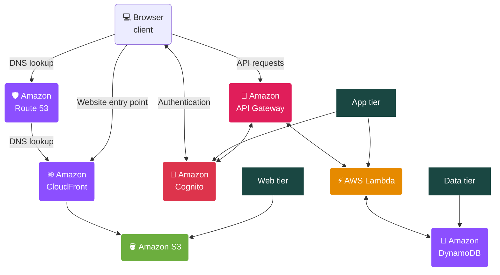
## Arquitectura de microservicios serverless

| Autónomo                                                              | Especializado                                                                         |
| --------------------------------------------------------------------- | ------------------------------------------------------------------------------------- |
| Se puede desarrollar e implementar sin afectar a otros microservicios | Realiza una única función de negocio, resolviendo un problema específico              |
| Escala de manera independiente                                        | Pertenece a un equipo de desarrollo pequeño que selecciona herramientas de desarrollo |
| No comparte código con otros microservicios                           | Es stateless                                                                          |
| Se comunica mediante APIs bien definidas                              | Tiene su propio almacenamiento de datos                                               |

### Beneficios
- Agilidad 
- Código reutilizable
- Escalamiento flexible
- Libertad tecnológica
- Resiliencia
- Implementación simplificada

### Patrones de microservicios serverless en AWS

#### RESTful APIs

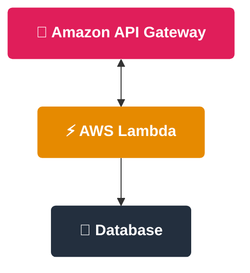
#### Containers

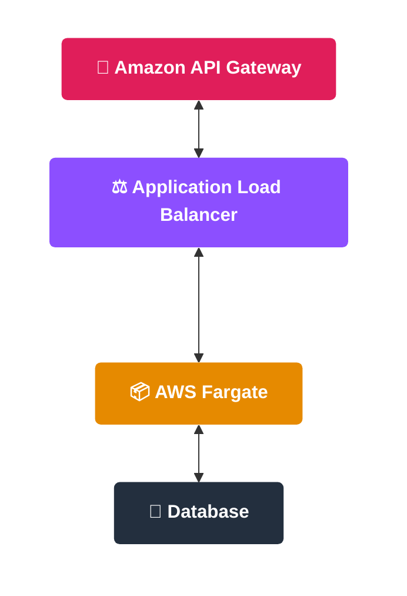

#### Streaming
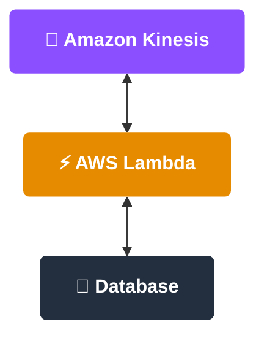


### Microservicios en una arquitectura web serverless


## Arquitecturas serverless con AWS Lambda

| Tareas                                            | Servidor en una VPC | Serverless |
| ------------------------------------------------- | ------------------- | ---------- |
| Configurar una instancia                          | Yes                 | No         |
| Actualizar el sistema operativo                   | Yes                 | No         |
| Instalar la plataforma de aplicación              | Yes                 | No         |
| Construir e implementar aplicaciones              | Yes                 | Yes        |
| Configurar el escalamiento y el balanceo de carga | Yes                 | No         |
| Proteger y monitorear instancias continuamente    | Yes                 | No         |
| Monitorear y mantener las aplicaciones            | Yes                 | Yes        |

### AWS Lambda

- AWS Lambda permite ejecutar funciones de código sin crear ni gestionar servidores.
- Las funciones Lambda son configurables respecto de: lenguaje de ejecución, cantidad de memoria y duración.
- Una función puede durar 15 minutos como máximo.
- Las funciones se implementan como archivos .zip o imágenes de contenedores.

### Funciones Lambda - Ubicaciones

**En el servicio AWS Lambda**


**En un cache regional de Amazon CloudFront**


### Conectar una función Lambda a una VPC


### Escenarios para usar funciones Lambda

| Procesamiento sincrónico        | Procesamiento asincrónico        | Procesamiento de streaming |
| ------------------------------- | -------------------------------- | -------------------------- |
| Aplicaciones web                | Eventos programados              | Aplicaciones de streaming  |
| Servicios web                   | Mensajes en colas                |                            |
| Microservicios                  | Transformación de imagen o video |                            |
| Inferencias de machine learning | Triggers de servicios de AWS     |                            |

### Funciones Lambda sincrónicas

#### Usando un API Gateway
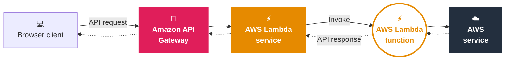

#### Usando la URL de la función Lambda desde una API externa

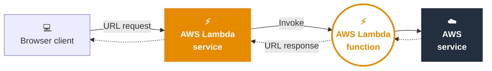

### Funciones Lambda asincrónicas

#### Trigger de un servicio de AWS
```mermaid
flowchart LR

    %% --- Nodes ---
    Start(( ))
    
    S3["🪣<br>Amazon Simple<br>Storage Service<br>(Amazon S3) bucket"]
    L_Service["⚡<br>AWS Lambda<br>service"]
    Int_Queue["📥<br>Lambda<br>internal<br>queue"]
    L_Func(("⚡<br>AWS Lambda<br>function"))
    SQS["📨<br>Amazon Simple Queue<br>Service (Amazon SQS)<br>error queue"]
    
    Start -->|"Upload object"| S3
    S3 -->|"Trigger"| L_Service
    L_Service --> Int_Queue
    Int_Queue --> L_Func
    L_Func -->|"Error<br>destination"| SQS

    %% --- Styles ---
    classDef header fill:#438dd5,stroke:none,color:white,font-weight:bold,font-size:18px
    classDef hidden display:none
    classDef green fill:#fff,stroke:#6cae3e,stroke-width:2px,color:#000
    classDef orangeSquare fill:#e68a00,stroke:none,color:white,font-weight:bold
    classDef orangeBorder fill:#fff,stroke:#e68a00,stroke-width:2px,color:#000
    classDef orangeCircle fill:#fff,stroke:#e68a00,stroke-width:3px,color:#e68a00,font-weight:bold
    classDef pinkBorder fill:#fff,stroke:#e01e5a,stroke-width:2px,color:#000

    %% Explicit Class Assignment
    class TitleNode header
    class Start hidden
    class S3 green
    class L_Service orangeSquare
    class Int_Queue orangeBorder
    class L_Func orangeCircle
    class SQS pinkBorder
```


#### Evento programado
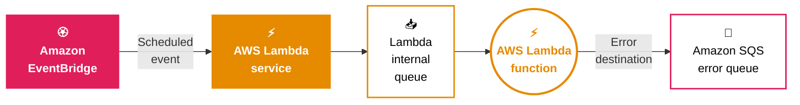

### Streaming y colas - Source mapping

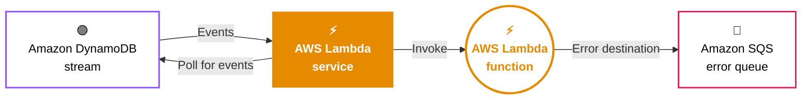

### Handler de una función Lambda en Python
```py
import json

def lambda_handler(event, context):
    length=event['length']
    width=event['width']

    area = calculate_area(length, width)

    data = {"area": area}
    return json.dumps(data)

def calculate_area(length, width):
    return length*width
```
- **Line 2**: Event object is a JSON document containing input data and invoking service data
- **Line 2**: Context object provides methods and properties about function runtime and invocation.
- **Line 7**: `json.dumps(data)` returns result as a JSON document.
- **Lines 8 and 9**: Business logic method

### Capas de funciones lambda


## Contenedores en AWS

### Casos de uso vs funciones lambda

| Más de 15 minutos                                                                    | Aplicaciones que usan mucha memoria                                                             | Costo                                                                                                                                                                             | Migración de contenedores legacy                                                                                |
| ------------------------------------------------------------------------------------ | ----------------------------------------------------------------------------------------------- | --------------------------------------------------------------------------------------------------------------------------------------------------------------------------------- | --------------------------------------------------------------------------------------------------------------- |
| AWS Lambda tiene un límite de 15 minutos de duración para la ejecución de funciones. | Las cargas de trabajo que exceden los 10 GB de memoria no son apropiadas para funciones lambda. | Los contenedores pueden ejecutarse de manera continua con costo fijo. El precio de una función lambda aumenta con la cantidad de ejecuciones, la duración y la memoria utilizada. | Los contenedores pueden ayudar a migrar aplicaciones legacy que se ejecutan on-premises o en instancias de EC2. |

### Beneficios


### Casos de uso
- Aplicaciones con microservicios
- Procesamiento batch
- Escalar modelos de machine learning (ML)
- Estandarizar aplicaciones de arquitectura híbrida
- Migrar aplicaciones a la nube

### Docker containers


### Servicios de contenedores en AWS

| Registro                                       | Orquestación                                   | Cómputo                                   |
| ---------------------------------------------- | ---------------------------------------------- | ----------------------------------------- |
| Amazon Elastic Container Registry (Amazon ECR) | Amazon Elastic Container Service (Amazon ECS)  | Amazon Elastic Compute Cloud (Amazon EC2) |
|                                                | Amazon Elastic Kubernetes Service (Amazon EKS) | AWS Fargate                               |
|                                                |                                                | AWS Lambda                                |

### Beneficios de AWS Fargate

| Sin gestión de clusters o servidores                                               | Facturación por segundo | Escalamiento automático                                                            | Adecuado para equipos nuevos                                          |
| ---------------------------------------------------------------------------------- | ----------------------- | ---------------------------------------------------------------------------------- | --------------------------------------------------------------------- |
| • No hay que crear ni mantener servidores.<br>• No necesitamos optimizar clusters. | • Pago por uso          | • Escalamiento automático de tareas según el uso de CPU, memoria u otras métricas. | • No requiere conocimiento profundo de la tecnología de contenedores. |

### Amazon ECS

#### Implementación y ejecución de contenedores


### Amazon EKS

#### Implementación y ejecución de contenedores


### Amazon EKS y Amazon ECS - Diferencias

| Tema                   | Amazon ECS                                             | Amazon EKS                                                                 |
| ---------------------- | ------------------------------------------------------ | -------------------------------------------------------------------------- |
| Complejidad            | Simplifica la creación y el mantenimiento de clusters. | Provee mayor control sobre los clusters, pero la interfaz es compleja.     |
| Escalamiento           | Escalamiento automático a demanda.                     | Configuración manual de los grupos de autoescalamiento.                    |
| Herramientas           | Amazon ECS                                             | Kubernetes                                                                 |
| Experiencia del equipo | Nuevo en la arquitectura de contenedores.              | Familiarizado con la arquitectura y los procesos de control de Kubernetes. |

## AWS Step Functions

### Microservicios - Desafíos

| Dependencias                                                                                                     | Escenarios de error                               | Coordinación                                                                                                                                               |
| ---------------------------------------------------------------------------------------------------------------- | ------------------------------------------------- | ---------------------------------------------------------------------------------------------------------------------------------------------------------- |
| • Administrar las dependencias entre microservicios<br>• Encadenar los microservicios en secuencia o en paralelo | • Ejecutar reintentos luego de errores o timeouts | • Escalar la aplicación<br>• Mantener el estado de microservicios stateless<br>• Pasar datos entre microservicios<br>• Monitoreo y resolución de problemas |

### AWS Step Functions

- Servicio de orquestación serverless que maneja flujos entre distintos servicios de AWS
- Tiene máquinas de estado (workflows) que contienen una serie de estados dependientes de eventos (pasos)
- Gestiona el estado, los checkpoints y los reinicios de cada workflow
- Tiene funciones para el tratamiento de errores
- Puede transferir datos entre estados
- Los estados pueden filtrar y manipular datos

### Flujos estándar o exprés

| Criterio                         | Standard Workflows                       | Express Workflows                                                     |
| -------------------------------- | ---------------------------------------- | --------------------------------------------------------------------- |
| Duración                         | Larga                                    | Breve, sin actividades                                                |
| Métricas                         | Historia completa en la consola          | Resultados en logs de CloudWatch                                      |
| Procesamiento                    | Asincrónico                              | Sincrónico o asincrónico                                              |
| Modelo de ejecución              | Exactamente una vez                      | • Sincrónico: al menos una vez<br>• Asincrónico: Como máximo, una vez |
| Progreso de la máquina de estado | Se persiste en cada transición de estado | Sin persistencia del estado en cada transición de estado              |
| Precios                          | Por cantidad de transiciones de estado   | Por cantidad y duración de llamadas por workflow                      |

### Casos de uso

- Orquestar microservicios
- Procesamiento de datos
- Machine Learning (ML)
- Automatización de seguridad

### Coordinación de estados

**Ejecución secuencial**
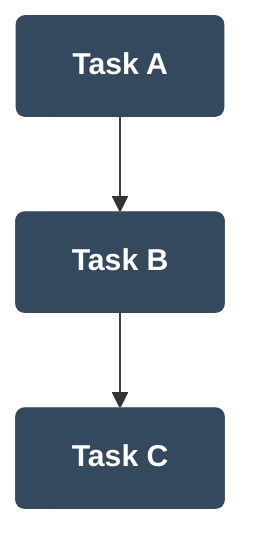

**Ejecución en paralelo**
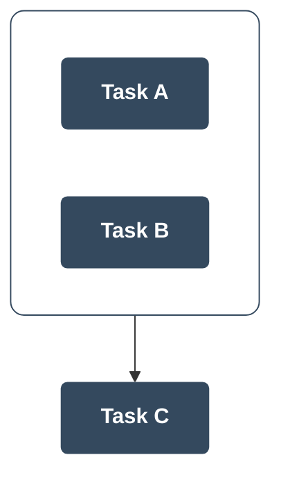

**Gestión de errores**
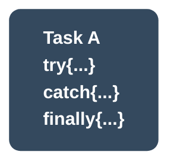

**Elegir tarea según los datos**
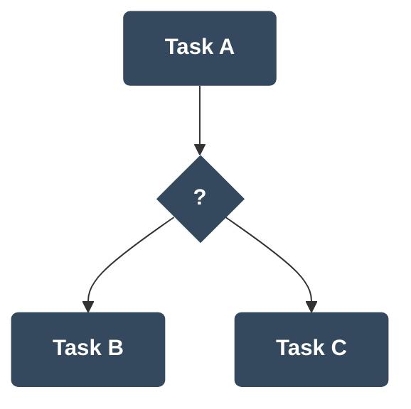

**Procesar tareas en paralelo (Map)**
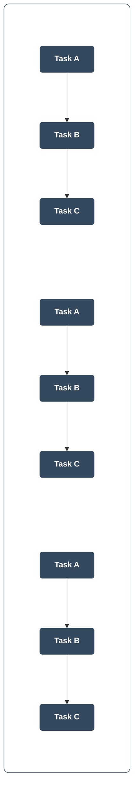

**Reiteración de tareas fallidas**
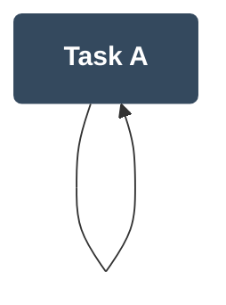


### Tipos de estado

| Estados de trabajo                                                               | Estados de transición                                                                                 | Estados de detención                                      |
| -------------------------------------------------------------------------------- | ----------------------------------------------------------------------------------------------------- | --------------------------------------------------------- |
| **Task**: Se integra con servicios de AWS                                        | **Choice**: Agrega condiciones para controlar el flujo hacia el estado siguiente                      | **Success**: Detiene la ejecución y la marca como exitosa |
| **Activity**: Realiza una tarea en cualquier lugar                               | **Parallel**: Agrega ramas de máquinas de estado anidadas en una máquina de estado                    | **Fail**: Detiene la ejecución y la marca como fallida    |
| **Pass**: Pasa o filtra datos de entrada al estado siguiente                     | **Map**: Separa el flujo de cada registro de datos en ejecuciones de data sets que corren en paralelo | **End parameter**: Detiene la ejecución                   |
| **Wait**: Demora el flujo por un período especificado                            |                                                                                                       |                                                           |
| **State has wait for callback state option**: Pausa el flujo y espera el retorno |                                                                                                       |                                                           |

### Ejemplo

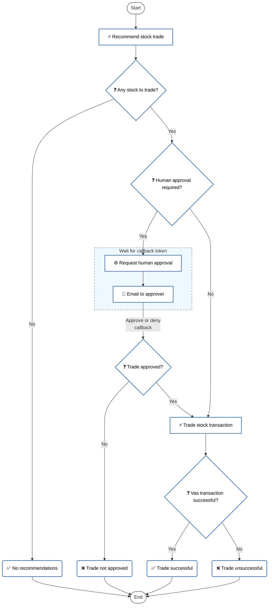

## Amazon API Gateway

### Ventajas de las API

| Estandarizar la comunicación entre apps                                                                                             | Proteger los microservicios                                                                                                                                        | Monetizar las API y registrar estadísticas                                                                   |
| ----------------------------------------------------------------------------------------------------------------------------------- | ------------------------------------------------------------------------------------------------------------------------------------------------------------------ | ------------------------------------------------------------------------------------------------------------ |
| • Estandarizar la conexión entre aplicaciones desarrolladas en distintos lenguajes<br>• Ocultar la complejidad de la implementación | • Decidir cuándo requerir autorización<br>• Verificar los formatos de las solicitudes<br>• Manejar la cantidad de solicitudes<br>• Restringir el acceso a recursos | • Registrar el acceso de clientes para gestionar la facturación<br>• Generar estadísticas de uso por cliente |

### API Gateway

- Permite crear, publicar y mantener APIs de tipo REST, HTTP, y WebSocket
- Gestión de tráfico, autorización y control de acceso a recursos configurables
- Brinda acceso a servicios de AWS y a endpoints de acceso público
- Mantiene múltiples versiones de una API deaplicación
- Establece planes de uso por cliente para monetizar y controlar el uso de las APIs
- Puede mantener un cache de respuestas comunes


### Tipos de API

| REST APIs                                                                                                                                                               | HTTP APIs                                                                                                                                   | WebSocket APIs                                                                                                                                              |
| ----------------------------------------------------------------------------------------------------------------------------------------------------------------------- | ------------------------------------------------------------------------------------------------------------------------------------------- | ----------------------------------------------------------------------------------------------------------------------------------------------------------- |
| • Colección de rutas y métodos<br>• Para aplicaciones que requieren funciones de administración de API<br>• Permite cross-origin resource sharing (CORS)<br>• Stateless | • Colección de rutas y métodos<br>• Para microservicios<br>• Menor latencia y menor costo que las API REST<br>• Soporta CORS<br>• Stateless | • Colección de rutas de WebSocket<br>• Para aplicaciones en tiempo real<br>• Establece una sesión entre el cliente y los servicios de backend<br>• Stateful |

### Integración con backend


## AWS Well-Architected Framework

- Reliability
    - Usar mecanismos DLQ para retener, investigar y volver a ejecutar transacciones fallidas
    - Ejecutar un roll back de las transacciones fallidas
- Security
    - Controlar el acceso a las API
    - Controlar el acceso a la aplicación serverless
    - Cifrar los datos en tránsito y en reposo
    - Implementar seguridad de aplicaciones en las cargas de trabajo
- Performance Efficiency
  - Optimizar el rendimiento de la aplicación
- Cost Optimization
    - Optimizar el costo de la aplicación
    - Usar integraciones de AWS