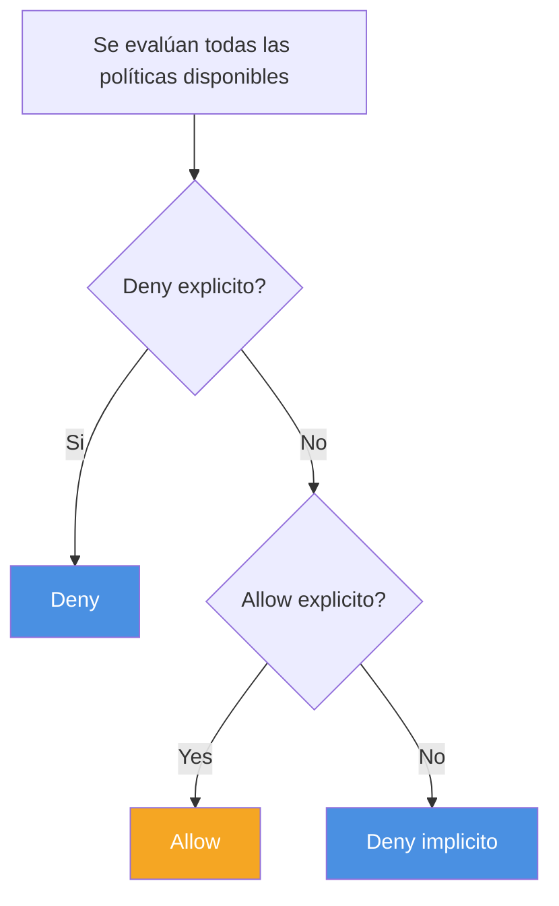

# Seguridad de acceso

> Esta clase abarca el módulo 3 del curso de AWS Cloud Architecting

## Modelos de responsabilidad compartida


## Principios de diseño

Gestión de identidades

## AWS Identity and Access Manager (IAM)

- Control de accesos a recursos de AWS para individuos o grupos
- Integración con otros servicios
- Federación de identidades
- Autenticación multifactor
- Permisos granulares

### Autenticar | Autorizar
No pienso mencionar la diferencia a esta altura.


### Definiciones

| Concepto      | Definición                                                                  | Ejemplos                                                     |
| ------------- | --------------------------------------------------------------------------- | ------------------------------------------------------------ |
| **Recurso**   | Objeto almacenado en IAM                                                    | Usuario, grupo, rol o política                               |
| **Entidad**   | Recurso de IAM que AWS usa para autenticación                               | Roles y usuarios                                             |
| **Identidad** | Recurso de IAM que puede recibir una autorización en una política de acceso | Usuarios, roles y grupos                                     |
| **Principal** | Persona o aplicación que puede ingresar (sign in) y generar requests en AWS | Usuarios y aplicaciones que interactúan con servicios de AWS |

### Acceso a recursos en AWS

| Tipo de Recurso | Definición                                                                       |
| --------------- | -------------------------------------------------------------------------------- |
| **Usuario**     | Una persona o aplicación que puede autenticarse con una cuenta de AWS            |
| **Grupo**       | Un grupo de usuarios IAM que tienen permisos idénticos                           |
| **Rol**         | Identidad que se utiliza para otorgar un conjunto **temporario** de permisos     |
| **Política**    | Documento que define los recursos accesibles y los niveles de acceso de cada uno |

### Autenticación
#### Credenciales
Tenés 2 formas de autenticarte dentro del ecosistema de AWS:
- Credenciales de usuario
  - Autenticación en la consola
  - Mail y contraseña
- AWS Access Key
  - AWS CLI
  - SDK
  - API Calls
  - Access Key ID + Secret Access Key

### Buenas prácticas de control de accesos

- Aplicar el principio de mínimo privilegio
- Habilitar la autenticación multifactor (MFA)
- Implementar el uso de credenciales temporales siempre que se pueda
- Rotar las claves de acceso para el uso de credenciales de largo plazo
- Usar contraseñas fuertes y complejas
- Proteger las credenciales locales
- Usar AWS Organizations

### Principio del mínimo privilegio


### Buenas prácticas de control de accesos

#### Proteger el usuario administrador


#### Usuarios y grupos


### Roles IAM en AWS

#### Definiciones

| ¿Qué es?                                                        | ¿Cuándo se usa?                                                                                        |
| --------------------------------------------------------------- | ------------------------------------------------------------------------------------------------------ |
| Un medio para obtener **credenciales transitorias**             | Cuando queremos delegar un acceso sin asignar permisos permanentes a un principal                      |
| No está asociado de manera unívoca con una persona              | **Ejemplos:**                                                                                          |
| Puede ser asumido por una persona, una aplicación o un servicio | - Accesos entre distintas cuentas de AWS<br>- Aplicaciones móviles<br>- Aplicaciones que corren en EC2 |


#### Políticas y permisos


**Definición de permisos en políticas IAM**:
- Se suelen definir en formato de JSON
- La política define los recursos y operaciones permitidos y denegados
- Siguen el principio de mínimo privilegio

**Proteger el usuario administrador**

**Evaluación de políticas IAM**



### Políticas

Ejemplos

### Identity-based vs Resource-based

**Identity-based (asociada con un usuario, grupo o rol)**

**Permisos de Juan**
| Recurso  | Get   | Put   | List  |
| -------- | ----- | ----- | ----- |
| Bucket 2 | Allow | Allow | Allow |
| Bucket 3 | N/A   | N/A   | Allow |

**Resource-based (adjunta a un recurso de AWS)**

| Bucket   | User | Get   | Put  | List  |
| -------- | ---- | ----- | ---- | ----- |
| Bucket 1 | Juan | Allow | Deny | Allow |
| Bucket 2 | Juan | Allow | N/A  | Allow |

> ¿Qué puede hacer Juan en el bucket 1? ¿Y en el bucket 2?

### Estructura de una política

### Estructura de una política

| Elemento  | Información                                                                                                                                                                                                                                         |
| --------- | --------------------------------------------------------------------------------------------------------------------------------------------------------------------------------------------------------------------------------------------------- |
| Version   | Versión del lenguaje que queremos usar                                                                                                                                                                                                              |
| Statement | Define qué se permite o deniega en función de ciertas condiciones                                                                                                                                                                                   |
| Effect    | Allow o deny                                                                                                                                                                                                                                        |
| Principal | **Política basada en recursos.** La cuenta, usuario, rol o usuario federado al que se otorga o deniega el permiso. <br> **Política basada en identidades.** Este dato es implícito, y corresponde al usuario o el rol al que se asocia la política. |
| Action    | La acción sobre la cual se otorga o deniega el permiso. <br> Ejemplo: `"Action": "s3:GetObject"`                                                                                                                                                    |
| Resource  | Recurso o recursos a los que se aplica la acción. <br> Por ejemplo: `"Resource": "arn:aws:sqs:us-west-2:123456789012:queue1"` <br> (ARN = AWS resource name)                                                                                        |
| Condition | Condiciones que deben cumplirse para que se aplique la regla                                                                                                                                                                                        |


### Ejemplos

#### Política basada en recursos
```json
{
  "Version": "2012-10-17",
  "Statement": [
    {
      "Effect": "Allow",
      "Action": [
        "dynamoDB:*",
        "s3:*"
      ],
      "Resource": [
        "arn:aws:dynamodb:region:account-numberwithout-hyphens:table/course-notes",
        "arn:aws:s3:::course-notes-web",
        "arn:aws:s3:::course-notes-mp3/*"
      ]
    },
    {
      "Effect": "Deny",
      "Action": [
        "dynamodb:*",
        "s3:*"
      ],
      "NotResource": [
        "arn:aws:dynamodb:region:account-number-withouthyphens:table/course-notes",
        "arn:aws:s3:::course-notes-web",
        "arn:aws:s3:::course-notes-mp3/*"
      ]
    }
  ]
}
```

#### Política basada en identidades
```json
{
    "Version": "2012-10-17",
    "Statement": [
        {
            "Effect": "Allow",
            "Action": [
                "iam:*LoginProfile",
                "iam:*AccessKey*",
                "iam:*SSHPublicKey*"
            ],
            "Resource": [
                "arn:aws:iam::account-id-without-hyphens:user/${aws:username}"
            ]
        }
    ]
}
```

[IAM API Reference](https://docs.aws.amazon.com/IAM/latest/APIReference/API_Operations.html)