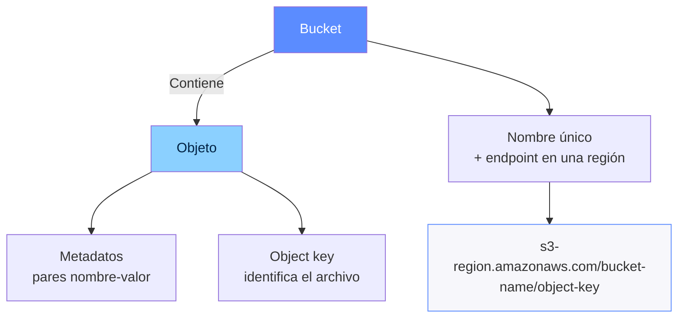

# Capa de almacenamiento

> Esta clase abarca el módulo 4 del curso de AWS Cloud Architecting

## Amazon S3

## Tipos de almacenamiento

### Amazon S3

- Almacena enormes cantidades (ilimitadas) de datos no estructurados.
- Almacena archivos como objetos en un bucket que nosotros definimos.
- El tamaño máximo de un archivo en un único objeto es de 5 TB.
- Los objetos tienen una URL única a nivel global (namespace universal).
- Los objetos tienen una clave, un ID de versión, un valor, metadatos y subrecursos.

#### Uso de prefijos

Estos objetos están en un bucket llamado `graphics-bucket`.

| Objetos en el bucket          |
| ----------------------------- |
| photos/2022/catpiano.jpg      |
| photos/2022/catonphone.jpg    |
| photos/2022/ninepuppies.png   |
| photos/2021/lakefront.png     |
| photos/2021/coveredbridge.png |
| photos/2021/openairmarket.jpg |
| video-source/9984.mp4         |
| video-source/9918.mp4         |
| video-source/18446.mp4        |

Una consulta `GET` con el prefijo `photos/2022` devuelve:

| Resultado de la consulta                    |
| ------------------------------------------- |
| graphics-bucket/photos/2022/catpiano.jpg    |
| graphics-bucket/photos/2022/catonphone.jpg  |
| graphics-bucket/photos/2022/ninepuppies.png |

#### Ventajas

| Durabilidad                                                                                                          | Disponibilidad                                                                                                                   | Alta performance                                                                                             |
| -------------------------------------------------------------------------------------------------------------------- | -------------------------------------------------------------------------------------------------------------------------------- | ------------------------------------------------------------------------------------------------------------ |
| Ayuda a evitar la pérdida de datos. Provee almacenamiento estándar con 11 nueves (99.999999999 %) de durabilidad. | Acceso a los datos a demanda. Capacidad ilimitada de almacenamiento. S3 estándar con 4 nueves (99.99 %) de disponibilidad. | Ejecuta miles de transacciones (upload/retrieve). Escala automáticamente cuando aumentan las solicitudes. |

#### Posibles casos de uso

| Picos en la demanda                                                                         | Sitios estáticos                                                           | Análisis financiero                                                  | Recuperación ante desastres                                     |
| ------------------------------------------------------------------------------------------- | -------------------------------------------------------------------------- | -------------------------------------------------------------------- | --------------------------------------------------------------- |
| Almacenar contenido web que necesita ancho de banda para tolerar picos extremos de demanda. | Almacenar un sitio estático, formado por archivos HTML, imágenes y videos. | Almacenar datos que otros servicios pueden usar para hacer análisis. | Guardar datos de resguardo o brindar soporte a la recuperación. |

#### Almacenamiento de objetos

- La cantidad de objetos que puede contener un bucket es ilimitada.
- Para subir un archive se requieren permisos de escritura sobre un bucket.
- Los objetos están cifrados por default:
  - Los objetos se cifran automáticamente usando cifrado del lado del servidor.
  - Durante la descarga, se descifran los objetos.

Amazon S3

Almacenamiento de objetos

| Medio                                | Descripción                                                                                                     |
| ------------------------------------ | --------------------------------------------------------------------------------------------------------------- |
| AWS Management Console               | Basado en un wizard para subir y bajar datos de S3, incluyendo la opción de drag & drop (tamaño máximo 160 GB). |
| AWS Command Line Interface (AWS CLI) | Se aplica por un comando desde una terminal o una llamada desde un script.                                      |
| AWS SDKs                             | Se usa el AWS SDKs para manejar objetos por programa.                                                           |
| Amazon S3 REST API                   | Una solicitud PUT permite subir objetos en una sola operación.                                                  |

#### Multipart upload

Ventajas:

- Mayor rendimiento.
- Rápida recuperación ante fallas de red.
- Capacidad de pausar y reiniciar.
- Se puede empezar a subir un archivo antes de conocer el tamaño final del objeto.

#### Transfer Acceleration

Ventajas:

- Transferencias rápidas y seguras en distancias largas
- Optimiza las velocidades de transferencia hacia S3.
- Usa las ubicaciones de borde de todo el mundo.
- Aumenta la velocidad para las transferencias de archivos grandes entre países.

#### Clases de almacenamiento de objetos

| Propósito general | Intelligent tiering    | Acceso infrecuente              | Archivo                                                                                                    |
| ----------------- | ---------------------- | ------------------------------- | ---------------------------------------------------------------------------------------------------------- |
| S3 Standard       | S3 Intelligent Tiering | S3 Standard IA S3 OneZone-IA | S3 Glacier Instant Retrieval S3 Glacier Flexible Retrieval S3 Glacier Deep Archive S3 on Outposts |

#### Configuración del ciclo de vida

Las configuraciones del ciclo de vida de Amazon S3 definen las acciones que Amazon S3 aplica a un grupo de objetos:

- Las acciones de transición definen el traslado de objetos a otra clase de almacenamiento.
- Las acciones de expiración definen cuándo expira un objeto.

#### AWS Identity and Access Manager (IAM)

#### Versionado

| Acción                             | Con versionado                                                                                   | Sin versionado                                          |
| ---------------------------------- | ------------------------------------------------------------------------------------------------ | ------------------------------------------------------- |
| Subir un objeto con la misma clave | Crea un nuevo objeto con una ID de versión diferente. Ambos son accesibles usando el version ID. | Sobreescribe el objeto original, que queda inaccesible. |
| Eliminar el objeto                 | Agrega una marca de borrado, pero el objeto queda accesible usando el ID de versión.             | Borra el objeto, que ya no queda accesible.             |

- Eliminación
  - 

- Recuperación de la última versión
  - 
  - Si la solicitud de un objeto eliminado incluye el ID de la versión, Amazon S3 nos devolverá esa versión del objeto.

- Eliminación permanente de un objeto
  - Para borrar definitivamente un objeto, se especifica el ID de la versión. En este caso, la eliminación es permanente.

#### CORS

Amazon S3

#### Modelo de consistencia de datos

- Es consistente para todos los objetos nuevos y existentes en todas las regiones.
- Provee consistencia read-after-write para todas las operaciones GET, LIST, PUT y DELETE que se apliquen a objetos que se encuentran en buckets de S3
- Ofrece una ventaja para las grandes cargas de datos
- Simplifica la migración de cargas analíticas onpremises.

#### Seguridad

- Los buckets y objetos son privados por default.
- El cifrado de buckets está configurada por default. Usa cifrado del lado del servidor con las claves gestionadas de Amazon S3 (SSE-S3).
- Para compartir datos en S3, debemos:
  - Administrar y controlar los accesos
  - Seguir el principio de mínimo privilegio.

#### Cifrado

- Server-side encryption
  - Amazon S3 cifra los objetos antes de grabarlos en disco y los descifra cuando los descargamos.
  - Esta es la opción por default de Amazon S3.

- Client-side encryption
  - Cifrar los datos del lado del cliente y subirlos ya encriptados.
  - En este caso, el proceso de cifrado es gestionado por el cliente.

Amazon S3

Herramientas de protección

| Herramienta                                           | Descripción                                                                    |
| ----------------------------------------------------- | ------------------------------------------------------------------------------ |
| Block Public Access                                   | Bloquea el acceso público a los buckets                                        |
| Políticas de AWS Identity and Access Management (IAM) | Autenticación de usuarios                                                      |
| Políticas de buckets                                  | Define accesos sobre la base de reglas específicas                             |
| Access control lists (ACLs)                           | Reglas de acceso a buckets y objetos (son preferibles las políticas)           |
| Amazon S3 access points                               | Se configura el acceso con nombres y permisos específicos para cada aplicación |
| URLs preasignadas                                     | Brinda acceso temporal mediante una URL                                        |
| AWS Trusted Advisor                                   | Permite chequear los permisos de un bucket                                     |

Amazon S3

#### Modelos de acceso

#### Selección de regiones

| Consideraciones                           | Detalles                                                                                                                                                                                                  |
| ----------------------------------------- | --------------------------------------------------------------------------------------------------------------------------------------------------------------------------------------------------------- |
| Cumplimiento legal y regulatorio          | • ¿Existen leyes relevantes de privacidad en la región? • ¿Los datos de los clientes se pueden almacenar fuera del país? • ¿Podemos cumplir nuestras obligaciones de gestión?                       |
| Proximidad entre los usuarios y los datos | • Pequeñas diferencias en la latencia pueden generar impacto en la experiencia del cliente. • Elegir la región más cercana a los usuarios.                                                             |
| Disponibilidad de los servicios           | • No todos los servicios de AWS están disponibles en todas las regiones. • Regularmente, se expanden los servicios a nuevas regiones. • El uso de servicios entre regiones aumenta la latencia.     |
| Costos                                    | • Los costos varían según la región. • Algunos servicios, como Amazon S3, tienen costo para las transferencias salientes. • Se deben evaluar los costos de replicar todo el entorno en otra región. |

#### Inventario

- Amazon S3 Inventory ayuda a administrar el almacenamiento.
- Se usa para auditoría y generar reportes sobre el estado de la replicación y la encripción de los objetos.
- Contribuye a cumplir los objetivos de negocio, de cumplimiento y regulatorios.
- Acelera los flujos de negocio y las tareas de análisis de datos.
- Brinda una alternativa programable a las operaciones sincrónicas de Amazon S3 (List API operations).

#### Costos

| Se paga por uso                                                                                                                                                                                                                         | No tienen costo                                                                                                                                                                                           |
| --------------------------------------------------------------------------------------------------------------------------------------------------------------------------------------------------------------------------------------- | --------------------------------------------------------------------------------------------------------------------------------------------------------------------------------------------------------- |
| • Los gigabytes de objetos almacenados (por mes). Los precios varían por región y por tipo de almacenamiento. • PUT, COPY, POST, LIST • Las transiciones que mueven datos entre las diferentes clases de almacenamiento Amazon S3 | • Los datos salientes hacia internet, hasta los primeros 100 GB por mes • Los datos transferidos entre buckets de S3 o hacia cualquier servicio de AWS dentro de la misma región • Hacia CloudFront |