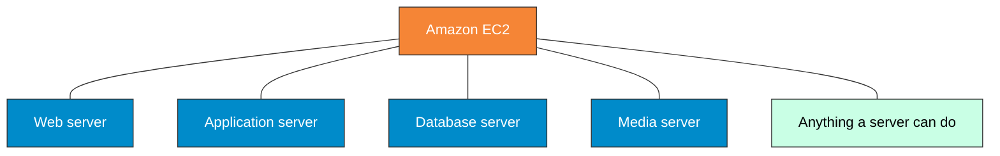
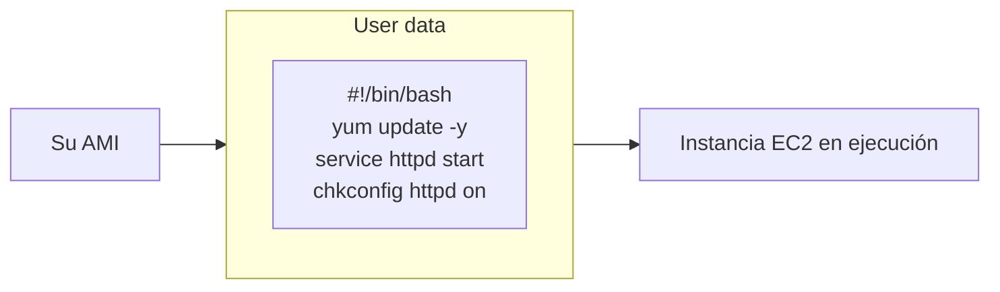
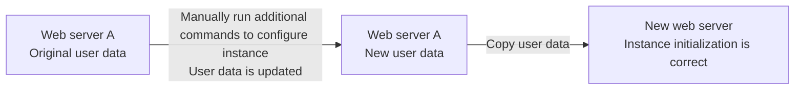
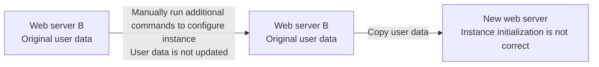

# Servicios de cómputo

> Esta clase abarca el módulo 5 del curso de AWS Cloud Architecting

## Objetivos

- Identificar cómo usar Amazon Elastic Compute Cloud (Amazon EC2) en una arquitectura.
- Explicar el valor de usar Amazon Machine Images (AMI) para acelerar la creación y la repetibilidad de la infraestructura.
- Recomendar tipos de instancias de EC2 según los requerimientos.
- Recomendar soluciones de almacenamiento para Amazon EC2.
- Reconocer cómo configurar instancias de Amazon EC2 con datos de usuario.
- Describir las opciones de precios de EC2 y hacer recomendaciones basadas en el costo.
- Lanzar una instancia de Amazon EC2.
- Utilizar los principios de AWS Well-Architected Framework al diseñar una capa de cómputo con Amazon EC2.

## Opciones de cómputo en tiempo de ejecución de AWS


## Servicios de cómputo

Cada categoría de servicio ofrece distintos niveles de control de infraestructura y velocidad de despliegue de aplicaciones


### Amazon EC2

- Proporciona máquinas virtuales (servidores) en la nube.
- Aprovisiona servidores en minutos.
- Puede aumentar o reducir automáticamente la capacidad según sea necesario.
- Permite pagar sólo por la capacidad que se utiliza.

**Una instancia EC2 es una VM que corre en un servidor físico**


#### Casos de uso

Siempre que se necesite:

- Control completo de sus recursos de cómputo, incluyendo sistema operative y tipo de procesador.
- Opciones para optimizar sus costos de cómputo
- Instancias On-Demand , reservadas y Spot
- Savings Plans
- Capacidad para correr cualquier tipo de carga de trabajo
- Sitios Web simples
- Aplicaciones empresariales
- Aplicaciones de inteligencia artificial generativa



#### Pasos para aprovisionar una instancia


### Amazon Machine Image (AMI)

Una AMI provee la información necesaria para lanzar una instancia, incluyendo:

- Un template para el volumen raíz: contiene el sistema operativo anfitrión y opcionalmente otro software instalado
- Permisos: Controla quién puede acceder la AMI
- Mapeos a dispositivos de bloque: Especifica los volúmenes de almacenamiento conectados a la instancia

Es básicamente una "receta" de cómo se van a crear todas las instancias lanzadas desde esta imagen.

#### Beneficios

| Repetibilidad                                                                              | Reusabilidad                                                                   | Recuperabilidad                                                                                                                                                                           |
| ------------------------------------------------------------------------------------------ | ------------------------------------------------------------------------------ | ----------------------------------------------------------------------------------------------------------------------------------------------------------------------------------------- |
| Una AMI se puede usar en forma repetida para lanzar instancias con eficiencia y precisión. | Las instancias lanzadas con la misma AMI están configuradas de forma idéntica. | Se puede crear una AMI a partir de una instancia configurada como un backup que se puede restaurar.<br>Se puede reemplazar una instancia que falló lanzando una nueva desde la misma AMI. |

#### Selección

**Criterios:**
- Región
- Sistema Operativo
- Tipo de almacenamiento del dispositivo raíz
- Arquitectura
- Tipo de virtualización: Para mejor desempeño, use AMIs con tipo de virtualización Hardware Virtual Machine (HVM)

| AMI source      |                                                         |
| --------------- | ------------------------------------------------------- |
| Quick Start     | AMIs con Linux y Microsoft Windows provistas por AWS.   |
| My AMIs         | AMIs creadas por el usuario.                            |
| AWS Marketplace | Templates pre-configurados por terceros.                |
| Community AMIs  | AMIs compartidas por otros. Usar bajo su propio riesgo. |


#### Instancias store-backed vs Amazon EBS-backed AMI

| Característica                            | Instancia respaldada por Amazon EBS                                                                                | Instancia respaldada por Instance Store                                              |
| ----------------------------------------- | ------------------------------------------------------------------------------------------------------------------ | ------------------------------------------------------------------------------------ |
| Tiempo de arranque de la instancia        | Arranca más rápido                                                                                                 | Tarda más en arrancar                                                                |
| Tamaño máximo del dispositivo raíz        | 16 TiB                                                                                                             | 10 GiB                                                                               |
| Capacidad de detener la instancia         | Puede detener la instancia                                                                                         | No puede estar en un estado detenido; las instancias están en ejecución o terminadas |
| Capacidad de cambiar el tipo de instancia | Puede cambiar el tipo de instancia deteniendo la instancia                                                         | No puede cambiar el tipo de instancia porque la instancia no puede detenerse         |
| Cargos de instancia                       | Se cobra por el uso de la instancia, el uso del volumen EBS y el almacenamiento de su AMI como una instantánea EBS | Se cobra por el uso de la instancia y el almacenamiento de su AMI en Amazon S3       |
| Caso de uso                               | Almacenamiento persistente                                                                                         | Almacenamiento temporal                                                              |

#### Ciclo de vida de una instancia


#### Creación de una AMI


### EC2 Image Builder

EC2 Image Builder automatiza la creación, gestión e implementación de imágenes de VMs.

- Brinda una interfaz gráfica para crear pipelines de creación de imágenes
- Crea y mantiene AMIs de Amazon EC2 e imágenes de VM on-prem.
- Produce imágenes seguras, validadas y actualizadas
- Asegura el control de versiones

#### Configuración del tipo de instancia

El tipo de instancia de EC2 define la configuración de CPU, memoria, almacenamiento y performance de red.

| Tipo de instancia | vCPU | Memoria | Almacenamiento   | Rendimiento de red |
| ----------------- | ---- | ------- | ---------------- | ------------------ |
| m5d.large         | 2    | 4 GiB   | 1 x 50 NVMe SSD  | Hasta 10 Gbps      |
| m5d.xlarge        | 4    | 8 GiB   | 1 x 100 NVMe SSD | Hasta 10 Gbps      |
| m5d.8xlarge       | 32   | 128 GiB | 2 x 600 NVMe SSD | 10 Gbps            |

#### Nombres de los tipos de instancias

**Componentes de los nombres**
Véase el siguiente nombre: `c7gn.xlarge`. De acá podemos identificar:

- Familia: `c`
- Generación: `7`
- Familia de procesador: `g`
- Capacidades adicionales: `n`
- Tamaño: `xlarge`

### Tipos de instancias según carga de trabajo

| Tipo                                                         | Ejemplos de cargas                                                                                                                   | Ejemplos de tipos de instancia                             |
| ------------------------------------------------------------ | ------------------------------------------------------------------------------------------------------------------------------------ | ---------------------------------------------------------- |
| Instancias de propósito general                              | • Servidores de aplicación o Web<br>• Aplicaciones empresariales<br>• Servidores para juegos<br>• Ambientes para desarrollo o prueba | M7, Mac, M6, M5, M4, T4, T3, T2                            |
| Instancias optimizadas para cómputo                          | • Procesamiento por lotes<br>• Aplicaciones analíticas distribuidas<br>• High performance computing (HPC)                            | C7, C6, C5, C4                                             |
| Instancias optimizadas para almacenamiento                   | • Bases de datos de alto rendimiento<br>• Analítica en tiempo real<br>• Cargas transaccionales                                       | I4, Im4, Is4, I3, D2, D3, H1                               |
| Memory optimized instance types                              | • In-memory caches<br>• Bases de datos de alto rendimiento<br>• Aplicaciones analíticas "Big Data"                                   | R7, R6, R5, R4, X2, X1, Z1                                 |
| Instancias con aceleración de cómputo                        | • Machine learning, inteligencia artificial (IA)<br>• HPC                                                                            | P5, P4, P3, P2, DL1, Trn1, Inf2, Inf1, G5, G4, G3, F1, VT1 |
| Instancias optimizadas para High performance computing (HPC) | • Cargas de aprendizaje profundo<br>• Cargas de HPC intensivas en cómputo                                                            | Hpc7, Hpc6                                                 |

#### Selección de la instancia más adecuada

**Con 270 tipos de instancia disponibles, ¿cómo seleccionar el adecuado?**

- Considere los requerimientos tanto de desempeño como de costo.
- Use los recursos disponibles para obtener recomendaciones.

| Tarea                                   | Solución                                                                                                                                                                                                                       |
| --------------------------------------- | ------------------------------------------------------------------------------------------------------------------------------------------------------------------------------------------------------------------------------ |
| Creación de una nueva instancia         | En la consola de EC2, use la página de Tipos de Instancia para filtrar según las características seleccionadas.<br>Recomendación: La última generación de cada familia generalmente tiene la mejor relación costo/rendimiento. |
| Optimización de una instancia existente | Puede obtener recomendaciones para optimizar el tipo de instancia mediante AWS Compute Optimizer.<br>Puede evaluar recomendaciones y modificar la instancia de acuerdo a ellas.                                                |

### AWS Compute Optimizer

Recomienda el tipo y tamaño de instancia, y configuración de grupo de Auto Scaling  óptimos
Analiza patrones de carga de trabajo y hace recomendaciones. 
Clasifica los hallazgos en las instancias como aprovisionamiento insuficiente, excesivo, optimizado o Ninguno.

### Puntos clave

Un tipo de instancia EC2 define una configuración de características de rendimiento de CPU, memoria, almacenamiento y red. Como recomendación, elija tipos de instancias de nueva generación en una familia porque generalmente tienen mejores relaciones precio-rendimiento. Utilice la página Tipos de instancia en la consola de Amazon EC2 y AWS Compute Optimizer para encontrar el tipo de instancia adecuado para su carga de trabajo

### Almacenamiento en instancias EC2

| Recurso de almacenamiento de EC2                | Volumen raíz | Volúmenes de datos para una sola instancia | Volúmenes de datos que se pueden acceder desde varias instancias de Linux | Volúmenes de datos que se pueden acceder desde varias instancias de Windows |
| ----------------------------------------------- | ------------ | ------------------------------------------ | ------------------------------------------------------------------------- | --------------------------------------------------------------------------- |
| Amazon EBS (Sólo SSD)                           | Sí           | Sí                                         | No                                                                        | No                                                                          |
| Instance store                                  | Sí           | Sí                                         | No                                                                        | No                                                                          |
| Amazon Elastic File System (Amazon EFS) [Linux] | No           | No                                         | Sí                                                                        | No                                                                          |
| Amazon FSx for Windows File Server              | No           | No                                         | No                                                                        | Sí                                                                          |

Una instancia EC2 siempre va a tener un volumen raíz, y opcionalmente uno o más volúmenes de datos.

### Instance stores

Un instance store proporciona almacenamiento no persistente a una instancia. El volumen de datos se almacena en el mismo servidor físico donde se ejecuta la instancia.

**Características**
- Almacenamiento temporario orientado a bloque
- Usa HDD o SSD
- Los datos del instance store se pierden cuando la instancia es detenida o terminada.

**Ejemplos de caso de uso**
- Buffers
- Cache
- Datos temporarios

### Amazon EBS

Los volúmenes Amazon EBS proveen almacenamiento persistente conectado por red a instancias EC2.

**Características**
- Almacenamiento persistente en bloques
- Puede conectarse a cualquier instancia en la misma AZ
- Usa HDD o SSD
- Puede estar cifrado
- Soporta snapshots que son persistidos en S3
- Los datos persisten independientemente de la vida de la instancia.

**Ejemplos de caso de uso**
- Bases de datos stand-alone
- Almacenamiento de datos de aplicación

#### Volúmenes respaldados por HDD

Los volúmenes respaldados por HDD de Amazon EBS funcionan bien cuando el foco está en el rendimiento (throughput).

| Tipo de volumen                | Descripción                                                                                                 | Casos de uso                                                                                                                                                                                                  |
| ------------------------------ | ----------------------------------------------------------------------------------------------------------- | ------------------------------------------------------------------------------------------------------------------------------------------------------------------------------------------------------------- |
| Throughput Optimized HDD (st1) | • Tipo de volumen de bajo costo<br>• Diseñado para cargas de trabajo de alto rendimiento y acceso frecuente | • Cargas de streaming<br>• Big data<br>• Data warehouses<br>• Procesamiento de logs<br>• No puede ser un volumen de boot                                                                                      |
| Cold HDD (sc1)                 | • Volumen HDD de menor costo<br>• Diseñado para cargas de trabajo con acceso menos frecuente                | • Almacenamiento orientado al throughput para grandes volúmenes de datos de acceso poco frecuente<br>• Casos de uso donde el menor costo de almacenamiento es importante<br>• No puede ser un volumen de boot |

### Instancias optimizadas para EBS

Algunos tipos de instancia EC2 pueden ser EBS-optimized

**Beneficios**
- Proporciona una conexión de red dedicada a los volúmenes EBS conectados.
- Aumenta el rendimiento de E/S.
- Se consigue un rendimiento adicional si se utiliza una instancia basada en el sistema Amazon EC2 Nitro.

**Uso**
- Para los tipos de instancias EBS-optimized, la optimización está habilitada de forma predeterminada
- Para otros tipos de instancias compatibles, la optimización debe habilitarse manualmente

### Instancias EC2

#### Sistemas de archivos compartidos

¿Qué sucede si tenemos varias instancias que deben usar el mismo almacenamiento?


### Amazon Elastic File System

### Amazon EFS

- Proporciona almacenamiento de sistema de archivos para cargas de trabajo basadas en Linux.
- Sistema de archivos elástico totalmente gestionado.
- Se escala automáticamente a medida que se añaden o eliminan archivos.
- Petabytes de capacidad.
- Soporta los protocolos de Network File Systems (NFS).
- Monta el sistema de archivos en la instancia EC2.
- Compatible con todas las AMI basadas en Linux para Amazon EC2.

#### Casos de uso

Algunos ejemplos de aplicaciones y cargas de trabajo comunes para Amazon EFS incluyen:
- Home directories
- Sistema de archivos para aplicaciones empresariales
- Pruebas y desarrollo de aplicaciones
- Copias de seguridad de bases de datos
- Servidores web y gestión de contenido
- Flujos de trabajo multimedia
- Análiticos de big data

Ejemplo de comando para montar el file  system en cada uno de las instancias:

```bash
sudo mount -t nfs4 mount-target-DNS:/ ~/efs-mount-point
```

#### Standard class storage


#### One-zone class storage


### Amazon FSx
For Windows file server

- Proporciona almacenamiento de sistema de archivos compartido totalmente administrado para instancias EC2 de Microsoft Windows.
- Compatibilidad nativa con Microsoft Windows.
- Sistema de archivos NTFS
- Utiliza el protocolo nativo Server Message Block (SMB) versión 2.0 a 3.1.1.
- Espacios de nombres y replicación DFS de Distributed File System (DFS).
- Se integra con Microsoft Active Directory y admite listas de control de acceso (ACL) de Windows.
- Respaldado por almacenamiento SSD de alto rendimiento.

#### Casos de uso

- Home directories
- Cargas de trabajo de lift-and-shift de aplicaciones
- Workflows de medios y entretenimiento
- Análisis de datos (Data analytics)
- Servicios web y gestión de contenido
- Entornos de desarrollo de software

## Configuración de EC2

### EC2 instance user data



### Recuperación de metadatos de la instancia

- Los metadatos de una instancia son información sobre ella.
- Se puede acceder a ellos desde su instancia en esta URL: http://169.254.169.254/latest/meta-data/
- Se pueden recuperar desde un script de datos de usuario.


### Datos de usuario en instancias en ejecución


### Ejecución manual de comandos

**Best practice**



**Not best practice**




### Modelos de implementación de AMI

| AMI básica                               | Silver AMI                                                           | Golden AMI                                              |
| ---------------------------------------- | -------------------------------------------------------------------- | ------------------------------------------------------- |
| AMI base                                 | AWS Managed Services (AMS) provided mutable AMIs                     | Customized immutable AMIs                               |
| AMI configuradas solo con SO             | Configurations half baked into the AMI                               | Configurations fully baked into the AMI                 |
| Totalmente configurables y actualizables | Some configurations need to be done manually or by user data scripts | All instances using the same golden AMI behave the same |
| Tiempo de generación más corto           | Provides a balance between boot speed and build time                 | Shorter boot times but increases build times            |
| Arranque más lento                       |                                                                      | Shorter lifespan of the AMI                             |

### Modelos de implementación de AMI

Los Placement groups brindan control sobre dónde se ejecuta un grupo de instancias interdependientes en una zona de disponibilidad.

| Beneficios                                                                                               | Limitaciones                                                                                                                                             | Estrategias                          |
| -------------------------------------------------------------------------------------------------------- | -------------------------------------------------------------------------------------------------------------------------------------------------------- | ------------------------------------ |
| • Aumenta el rendimiento de la red entre instancias<br>• Reduce los fallos correlacionados o simultáneos | • Una instancia solo se puede lanzar en un placement group a la vez<br>• Las instancias con un tenancy de host no se pueden lanzar en un placement group | • Cluster<br>• Partition<br>• Spread |

## Opciones de precios

**AWS Free Tier: Amazon EC2 (12 meses gratis)**

- 750 horas por mes de instancias t4g.small dependiendo de la región
- 750 horas por mes de instancias Linux, RHEL, o SLES t2.micro o t3.micro dependiendo de la región
- 750 horas por mes de instancias Windows t2.micro o t3.micro dependiendo de la región

### Modelos de precios

Amazon EC2 ofrece las siguientes estrategias de compra para ayudar a optimizar sus costos según sus necesidades:

| Modelos de compra                                                                    | Modelos de Capacidad reservada                                                                                   | Modelos Dedicados                                                                                                    |
| ------------------------------------------------------------------------------------ | ---------------------------------------------------------------------------------------------------------------- | -------------------------------------------------------------------------------------------------------------------- |
| El énfasis está en proporcionar grandes ahorros a través de diferentes casos de uso. | El énfasis está en proporcionar instancias reservadas para garantizar que estén disponibles cuando se necesiten. | El énfasis está en proporcionar hardware dedicado que ayude a cumplir con requisitos de cumplimiento y regulatorios. |

### Modelos de compra

| On-Demand                                                                                        | Reservadas                                                                                           | Savings Plans                                                                                                                                               | Amazon EC2 Spot                                                                                    |
| ------------------------------------------------------------------------------------------------ | ---------------------------------------------------------------------------------------------------- | ----------------------------------------------------------------------------------------------------------------------------------------------------------- | -------------------------------------------------------------------------------------------------- |
| Se paga la capacidad de cómputo por segundo o por hora sin compromisos a largo plazo.            | Se compromete uso por 1 o 3 años a cambio de un descuento significativo sobre los precios on-demand. | Mismos descuentos que para instancias reservadas. Mayor flexibilidad a cambio de un compromiso de USD/hora                                                  | Capacidad de Amazon EC2 ociosa con ahorros substanciales sobre los precios On-Demand.              |
| **Recomendado para:**<br>• Cargas de trabajo con picos<br>• Cargas de trabajo de experimentación | **Recomendado para:**<br>• Cargas de trabajo comprometidas<br>• Cargas de trabajo estables           | **Recomendado para:**<br>• Todas las cargas de trabajo de Amazon EC2<br>• Cargas de trabajo de Amazon EC2 que requieran flexibilidad en el uso comprometido | **Recomendado para:**<br>• Cargas tolerantes a fallas<br>• Cargas flexibles<br>• Cargas sin estado |

### Reservas de capacidad

Las reservas de capacidad le permiten reservar capacidad de cómputo para instancias de Amazon EC2 en una zona de disponibilidad específica.

| On-Demand Capacity Reservations                                                                                                                                                         | Amazon EC2 Capacity Blocks for ML                                                                                                                                                                                           |
| --------------------------------------------------------------------------------------------------------------------------------------------------------------------------------------- | --------------------------------------------------------------------------------------------------------------------------------------------------------------------------------------------------------------------------- |
| Esto garantiza que siempre tendrá acceso a la capacidad de EC2 cuando la necesite, durante el tiempo que la necesite.                                                                   | Se reservan instancias de GPU para una fecha futura para ejecutar cargas de trabajo de aprendizaje automático (ML).                                                                                                         |
| **Casos de uso recomendados:**<br>• Cargas de trabajo que deben cumplir con los requisitos normativos de alta disponibilidad<br>• Cargas de trabajo que requieren garantía de capacidad | **Casos de uso recomendados:**<br>• Entrenamiento y ajuste de modelos de ML<br>• Ejecución de experimentos y creación de prototipos<br>• Planificación para futuros aumentos repentinos de la demanda de aplicaciones de ML |

### Opciones dedicadas

Las opciones dedicadas de Amazon EC2 brindan capacidad de instancia EC2 en servidores físicos dedicados para su uso (hardware single-tenant).

| Instancias dedicadas                             | Hosts dedicados                                                                                        |
| ------------------------------------------------ | ------------------------------------------------------------------------------------------------------ |
| Facturación por instancia                        | Facturación por host                                                                                   |
| Ubicación automática de instancias               | Visibilidad de sockets, núcleos e ID de host                                                           |
| Aísla los hosts donde se ejecutan sus instancias | Afinidad entre un host y una instancia                                                                 |
|                                                  | Ubicación de instancias específica                                                                     |
|                                                  | Aumento de capacidad mediante una solicitud de asignación                                              |
|                                                  | Permite usar las licencias de software vinculadas al servidor y cumplir con requisitos de cumplimiento |

### Guía de optimización de costos

Para optimizar el costo de las instancias de Amazon EC2, debemos combinar las opciones de compra disponibles.


- Escale usando Spot Instances para cargas que pueden tolerar fallas, flexibles o stateless.
- Use instancias On-Demand para cargas nuevas o stateful con picos
- Use Reserved Instances o Savings Plans para cargas conocidas y estables

## Well-Architected Framework

### Aplicación en soluciones de cómputo
- Protección de la infraestructura – Protección del cómputo
  - Automatice la protección de los recursos de cómputo.
- Protección de la infraestructura – Protección de redes
  - Controle el tráfico en todas las capas.
- Performance
    - Escale las mejores opciones de cómputo para su carga de trabajo.
    - Configure y dimensione adecuadamente los recursos de cómputo.
- Optimización de costos
    - Seleccione recursos del tipo, tamaño y cantidad correctos.
    - Seleccione el mejor modelo de precios.
- Hardware y servicios
    - Utilizar la mínima cantidad de hardware para satisfacer sus necesidades.
    - Usar tipos de instancia con el menor impacto.
- Sustainability 
  - Usar servicios gerenciados.