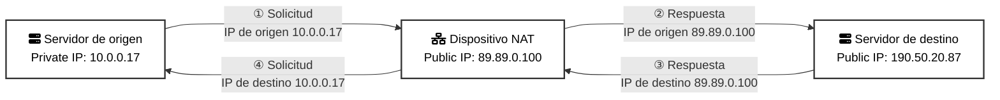

# Servicios de red

> Esta clase abarca el módulo 7 del curso de AWS Cloud Architecting

## Objetivos

- Explicar el rol de una red privada virtual (VPC) en AWS
- Identificar los componentes de una VPC que se conectan a internet.
- Aislar y proteger recursos dentro del entorno de red
- Crear y monitorear una VPC con subredes, un internet Gateway, tablas de ruteo y un grupo de seguridad
- Aplicar los principios del AWS Well-Architected Framework para planificar y crear un entorno de red


## Infraestructura física de AWS

### Componentes y jerarquía

- Los data centers de AWS tienen miles de servidores organizados en racks. Cada rack tiene routers de red y switches que direccionan el tráfico.
- Los data centers se agrupan en AWS Cloud Availability Zones (AZs).
- Las AZs se conectan en redes que tienen una latencia $< 10$ milisegundos.
- Las AZs están agrupadas en regiones.
- La latencia entre una región y otra es de decenas de milisegundos

### Aislar recursos en una cuenta AWS


### Amazon Virtual Private Cloud

- Es una red virtual definida por código, aislada lógicamente, similar a una red de un data center tradicional.
- Pertenece a una región
- Se puede personalizar para controlar el tráfico entrante y saliente.
- Se dimensiona mediante un rango de direcciones IP privadas: bloque CIDR (Classless Inter-Domain Routing block)

### Tabla de rutas principal


#### Subredes públicas


### Direcciones IP elásticas

Una dirección IP elástica es una dirección pública y estática asociada a una instancia. 

Una dirección IP elástica se puede transferir a una nueva instancia.

### Subredes privadas


### NAT IP mapping



### Conexión de subredes privadas a internet


## Recursos de red - Seguridad
Nos vamos a centrar en la seguridad de estos recursos

### Capas de seguridad de defensa


### Security groups y ACLs

- Los **security groups** funcionan como la llave de un departamento: dejan pasar a quien la tenga.
- Las **ACLs** protegen las  subredes como el portero de un edificio: deja entrar a quienes viven allí.

**Security groups**
- Son _stateful_.
- Actúan al nivel de una instancia o una interfaz de red.
- Se pueden aplicar en múltiples AZ.
- Se definen reglas para permitir tráfico, protocolos y rangos de puertos.
  - Por ejemplo, puedo bloquear todo el tráfico HTTPS para el SecGroup de todos los Load Balancers que instale en mi clúster
- Los recursos que tienen los mismos requisitos de seguridad deberían asociarse al mismo security group.

Ejemplo:

**Inbound security group rule**

| Source                          | Traffic type | Protocol | Port range |
| ------------------------------- | ------------ | -------- | ---------- |
| Load balancer security group ID | HTTPS        | TCP      | 443        |

**Network ACLs**

- Funcionan como firewalls _stateless_
- Controlan el tráfico entrante y saliente de una o más subredes
- Una subred puede tener una única ACL
- Una ACL se puede aplicar a varias subredes
- Las reglas entrantes y salientes pueden permitir o denegar el tráfico
- Deniegan por default el tráfico no incluido en otras reglas

Ejemplos:
- Inbound ACL rules

| Rule number | Source        | Traffic type | Protocol | Port range | Deny or allow |
| ----------- | ------------- | ------------ | -------- | ---------- | ------------- |
| 100         | 188.7.55.9/32 | HTTPS        | TCP      | 443        | Allow         |
| *           | 0.0.0.0/0     | All traffic  | All      | All        | Deny          |

- Outbound ACL rules

| Rule number | Source    | Traffic type | Protocol | Port range | Deny or allow |
| ----------- | --------- | ------------ | -------- | ---------- | ------------- |
| 100         | 0.0.0.0/0 | HTTPS        | TCP      | 443        | Allow         |
| *           | 0.0.0.0/0 | All traffic  | All      | All        | Deny          |

### Network ACL vs Security groups

| Característica               | Security groups                                     | Network ACLs                                                                     |
| ---------------------------- | --------------------------------------------------- | -------------------------------------------------------------------------------- |
| Nivel de operación           | Operan a nivel de recursos                          | Opera a nivel de la subred                                                       |
| Tipo de reglas               | Permiten tráfico                                    | Especifica reglas que *permiten* o *deniegan* tráfico                            |
| Estado de reglas             | Las reglas son *stateful*                           | Las reglas son *stateless*.                                                      |
| Evaluación de reglas         | Se evalúan todas las reglas                         | Las reglas se evalúan en orden. La evaluación termina cuando se aplica una regla |
| Tráfico entrante por default | Ningún tráfico entrante está permitido por default  | Todo el tráfico entrante está permitido por default                              |
| Tráfico saliente por default | Todo el tráfico saliente está permitido por default | Todo el tráfico saliente está permitido por default                              |

### Firewalls de red

- Brinda funciones de firewall de red y servicio de IDS/IPS
- Para proteger los recursos de una subred, se puede dirigir el tráfico externo a través de un AWS Network Firewall

## Conexión a servicios administrados de AWS - Creación de un entorno de red

> Acá pone unas cuántas imágenes de ejemplo de cómo configurar distintos casos, que la verdad que no lo veo necesario de incluir (ver slides 30-36 del siguiente pdf)

<embed src="../presentations/Nube con AWS - Clase 6.pdf" type="application/pdf" width="100%" height="600px" />

- Los recursos de VPC pueden acceder a los servicios administrados de AWS mediante endpoints de VPC.
- Un endpoint utiliza AWS PrivateLink para acceder a los servicios administrados de AWS. Esto genera costos y presenta limitaciones de rendimiento.
- Un Gateway VPC endpoint se integra directamente con Amazon S3 y Amazon DynamoDB. No genera costos ni tiene limitaciones de rendimiento.
- Los endpoints de Gateway Load Balancer se utilizan con Gateway Load Balancers para inspeccionar el tráfico con dispositivos de seguridad.

## Monitoreo de red - Otras consideraciones

### Resolución de problemas de red - Escenarios

- Tiempos de respuesta muy lentos en instancias EC2
- Imposibilidad de acceso a través de SSH
- No se aplican parches a las instancias de base de datos de EC2

### VPC Flow logs


#### Permisos sobre flow logs
```json
{
  "Version": "2012-10-17",
  "Statement": [
    {
      "Effect": "Allow",
      "Action": [
        "ec2:CreateFlowLogs",
        "ec2:DescribeFlowLogs",
        "ec2:DeleteFlowLogs"
      ],
      "Resource": "*"
    }
  ]
}
```
- La política de IAM otorga a los usuarios **permisos para crear, describir y eliminar** registros de flujo

**Ejemplo de flow log**

| Field name   | Field description                                                                                     | Example value         |
| ------------ | ----------------------------------------------------------------------------------------------------- | --------------------- |
| version      | Versión de los registros de flujo de VPC                                                              | 2                     |
| account-id   | Cuenta de AWS del propietario de la red                                                               | 123456789010          |
| interface-id | Interfaz de red de tráfico                                                                            | eni-1235b8ca123456789 |
| srcaddr      | Dirección de origen para el tráfico entrante o interfaz de dirección de red para el tráfico saliente  | 172.31.16.139         |
| dstaddr      | Dirección de destino para el tráfico saliente o dirección de interfaz de red para el tráfico entrante | 172.31.16.21          |
| srcport      | Puerto de origen del tráfico                                                                          | 20641                 |
| dstport      | Puerto de destino del tráfico                                                                         | 22                    |
| protocol     | Número de protocolo de IANA de tráfico                                                                | 6 (TCP)               |
| packets      | Cantidad de paquetes transferidos                                                                     | 20                    |
| bytes        | Cantidad de bytes transferidos                                                                        | 4249                  |
| start        | Tiempo Unix en segundos del primer paquete recibido                                                   | 1418530010            |
| end          | Tiempo Unix en segundos del último paquete recibido                                                   | 1418530070            |
| action       | Aceptar o rechazar el indicador de éxito o fracaso del enrutamiento del tráfico                       | ACCEPT                |
| log-status   | Estado del registro de flujo: OK, NODATA, SKIPDATA                                                    | OK                    |

### Resolución de problemas en VPC - Otras herramientas

- **Reachability Analyzer**
  - Permite probar la conectividad entre un recurso de origen y un recurso de destino en una VPC.
- **Network Access Analyzer**
  - Identificar accesos de red no deseados a los recursos de AWS.
- **Traffic Mirroring**
  - Hace una copia del tráfico de red y la envía a soluciones de seguridad y monitoreo.

## Well-Architected Framework - Aplicado a la red

### Pilares
- **Confiabilidad**: Asegurarse de asignar direcciones IP para permitir la expansion de los servicios
- **Seguridad**
  - Crear capas de red
  - Controlar el tráfico en todas las capas.
  - Implementar medidas de protección e inspección
- **Performance efficiency**
  - Entender el impacto de las redes en la performance
  - Evaluar las funciones de red disponibles
  - Elegir protocolos de red que aumenten la performance
- **Optimización de costos**
  - Tomar en cuenta los costos para elegir las regiones
    - Hay regiones más caras que otras