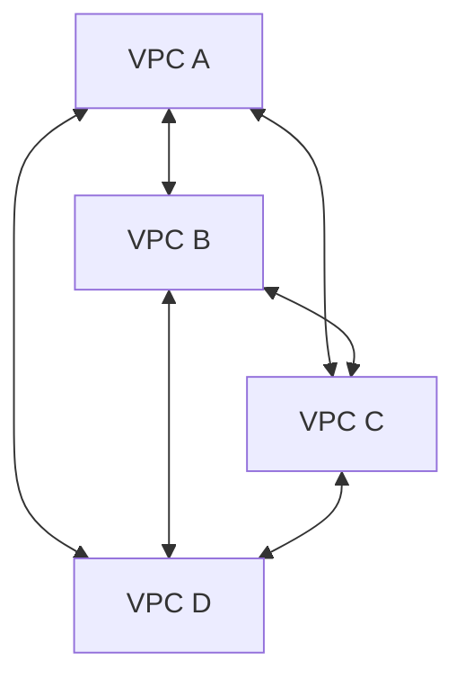
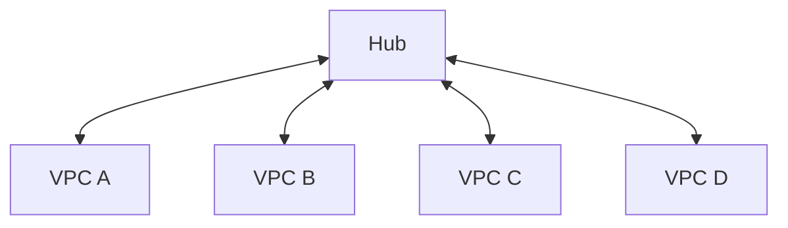
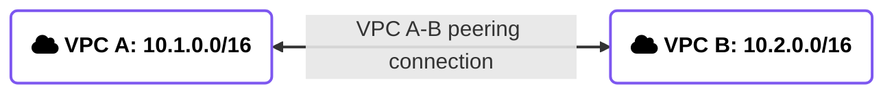
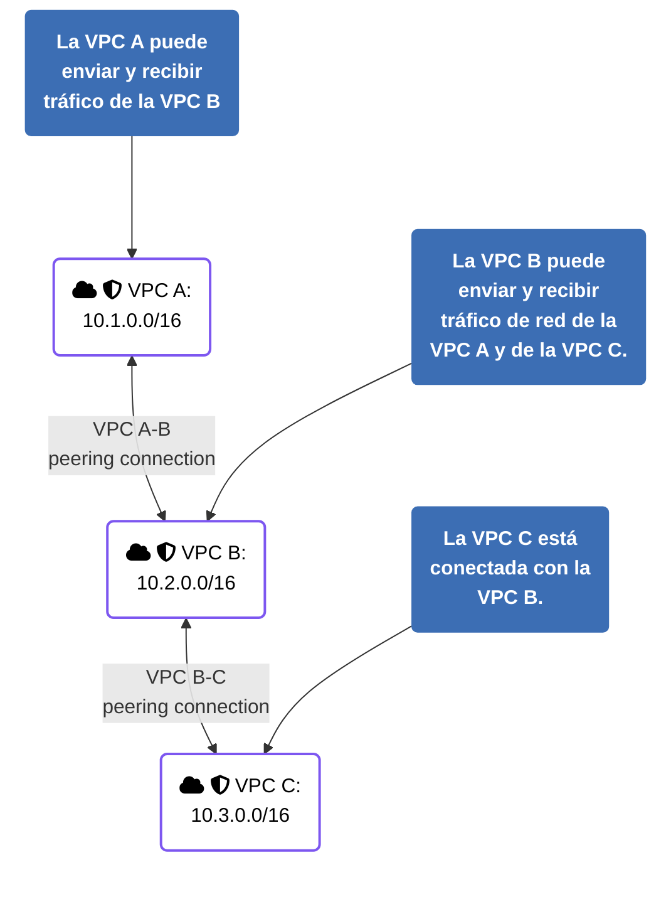

# Conexión entre redes

> Esta clase abarca el módulo 8 del curso de AWS Cloud Architecting

## Objetivos

- Describir cómo se conecta una red on-premises con los servicios de AWS
- Explicar cómo se conectan múltiples VPC entre sí
- Conectar VPC mediante peering
- Describir cómo se pueden escalar VPC en la nube de AWS
- Aplicar los principios del Well-Architected Framework

## Principios de arquitectura

- Diseñar las conexiones aplicando medidas para la continuidad y asegurando un ancho de banda adecuado, para las aplicaciones on-premises, en la nube o hibridas.
- Seleccionar componentes de red que optimicen la performance y reduzcan los costos de transferencia de datos entre redes, para maximizar el valor.
- Proteger los datos en tránsito entre redes

## Diseño de red con múltiples VPC
**Arquitectura Full Mesh**

**Arquitectura Hub-and-Spoke**

### AWS Transit Gateway

- Es un router centralizado, regional para conectar VPCs y redes on-premises sobre la base de una arquitectura hub-and-spoke
- Es un servicio administrado por AWS que escala automáticamente en base al volumen del tráfico de red.
- Se puede conectar con otros Transit Gateways en otras regiones o cuentas de AWS.
- El costo depende de la cantidad de conexiones y de la cantidad de tráfico
- Tiene una función que publica logs: **Transit Gateway Flow Logs**

### Ruteo con Transit Gateway entre VPCs

### Tráfico saliente entre VPC

### Conexión de dos Transit Gateways

Entre todas las maneras de conectar Transit Gateways, una de las más comunes es hacer `Peering`: conectar 2 TG punto a punto, básicamente.

### Caso de uso

- Una compañía tiene múltiples departamentos de IT, cada uno posee su propia VPC. 
- Algunas VPC están dentro de la misma cuenta de AWS, y otras están en cuentas distintas. 
- Queremos conectar todas las VPC para que tengan acceso a los recursos de las demás. 
- La compañía está evaluando la posibilidad de agregar nuevas cuentas en el futuro.

## VPC peering

### Arquitecturas mesh con VPC Peering

### ¿Cómo establecer una conexión?

**VPC A route table**
| Destination     | Target                        |
| :-------------- | :---------------------------- |
| **10.1.0.0/16** | local                         |
| **10.2.0.0/16** | VPC A-B peering connection ID |

**VPC B route table**

| Destination     | Target                        |
| :-------------- | :---------------------------- |
| **10.2.0.0/16** | local                         |
| **10.1.0.0/16** | VPC A-B peering connection ID |

### VPC peering connections

> El resto del PPT es auto-explicativo. Si en el futuro cuando vuelva a revisar el contenido del curso aparecen otros detalles que los slides se saltean, lo agrego a mano

> A partir de acá, ver PPT desde la slide 21

<embed src="../presentations/Nube con AWS - Clase 7.pdf" type="application/pdf" width="100%" height="600px" />