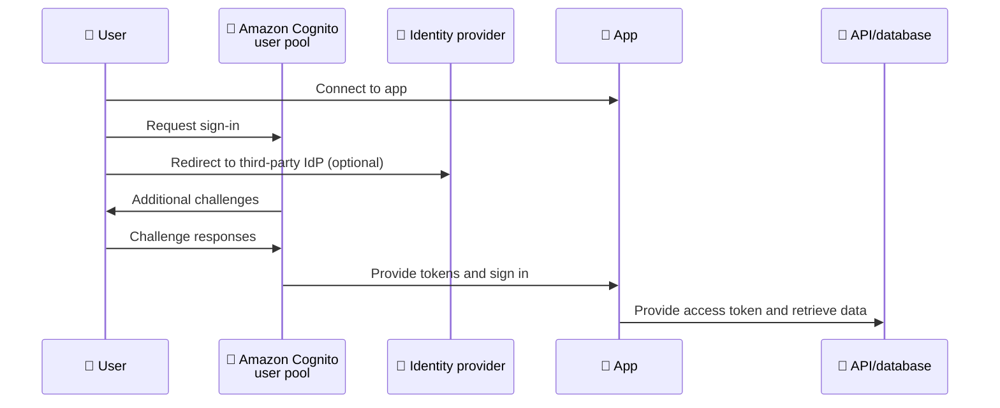
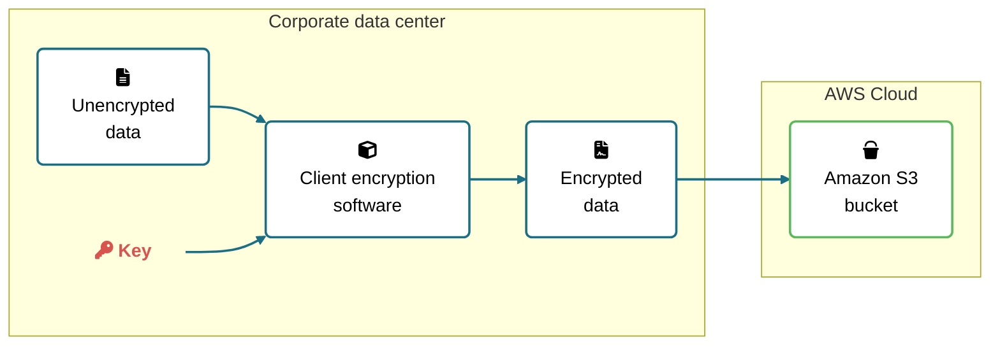
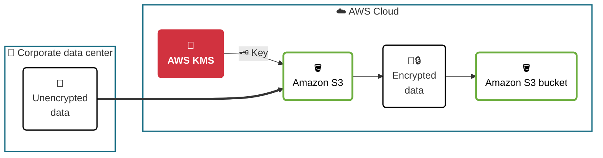

# Seguridad de usuarios, aplicaciones y datos

> Esta clase abarca el módulo 9 del curso de AWS Cloud Architecting

## Objetivos
- **Administrar permisos** mediante usuarios, grupos y roles de AWS IAM 
- **Implementar federación** de usuarios en una arquitectura para aumentar la seguridad 
- **Describir** cómo se manejan múltiples cuentas de AWS 
- **Reconocer** la función de las políticas de control de servicio (SCP) de AWS Organizations. 
- **Cifrar datos** en reposo usando AWS Key Management Service (AWS KMS). 
- **Identificar** los servicios de seguridad adecuados para ciertos casos de uso.

## Administración de permisos
### Gestión de permisos por usuarios
- **Configuración inicial**
  - Cada desarrollador recibe acceso total a Amazon EC2 a través de políticas vinculadas con usuarios individuales. 
- **Cuando se necesitan permisos adicionales...**
  - Cada desarrollador necesita acceso a Amazon S3. Para implementar el cambio, el administrador debe hacer tres modificaciones, una para cada política de usuario de IAM.
- **Crece la cantidad de usuarios**
  - Este enfoque resulta inmanejable. ¿Cuál es la solución más apropiada?

### Gestión de permisos por grupos


> Acá pone un par de ejemplos que no sé si son necesarios de explicar por completo (si tenés ganas de verlos, mirate el [PDF correspondiente](./presentations/Nube%20con%20AWS%20-%20Clase%208.pdf)), pero la idea fundamental es la siguiente:

- Si a un usuario se lo agrega a más de un grupo, los permisos que prevalecerán van a ser **los más restrictivos**
  - Ej: si un grupo tiene permiso explícito de borrar instancias de EC2 y otro justamente lo tiene denegado explícitamente, el usuario que pertenezca a ambos grupos **no va a poder** borrar instancias de EC2
  - Esto también aplica si hay un conflicto de políticas entre distintos niveles (ej: si declaro una política de usuario que permita y una de grupo que deniegue el acceso a un recurso en particular)

### Escalamiento usando RBAC
**Definición de roles**
- Crear una política IAM con los permisos del rol
- La política indica los recursos accesibles
- Asociar la política con una entidad de IAM (usuario, grupo o rol)

**Actualización del rol**
- Actualizar la política
- Si el nuevo recurso es usado por varios roles, es necesario modificar múltiples políticas

RBAC en cierto punto termina por ser poco escalable. ¿Cuál es la solución a eso? $\longrightarrow$ **ABAC**

### Uso de ABAC

| ¿Qué es?                                                                                                                                                                                                                                      | Ventajas                                                                                                                                                                                                                                     |
| --------------------------------------------------------------------------------------------------------------------------------------------------------------------------------------------------------------------------------------------- | -------------------------------------------------------------------------------------------------------------------------------------------------------------------------------------------------------------------------------------------- |
| • Estrategia de autorización que define permisos basados en atributos.<br>• Los atributos son claves o pares de clave-valor.<br>• En AWS, los atributos se llaman etiquetas (tags).<br>• Las etiquetas se aplican a recursos de IAM y de AWS. | • Es más flexible que las políticas en las que hay que identificar recursos individuales.<br>• Permiten asignar permisos granulares sin actualizar las políticas cada vez que se agrega un recurso.<br>• Es altamente escalable y auditable. |


### Etiquetas en AWS
Los famosos _tags_.

- Son metadatos conformados por un par (key/value).
- Se pueden aplicar a recursos de las cuentas de AWS, y también a usuarios y roles de IAM.
- Podemos crear nuestras propias etiquetas.
- Muchas de las API de AWS devuelven datos de etiquetas.
- Se utilizan para facturación, control de accesos o aplicación de filtros a las vistas.


## Federación de identidades
Es un sistema de confianza entre dos partes para autenticar usuarios y compartir información necesaria para autorizar el acceso a los recursos.

| Proveedor de identidad (IdP)                                                                                                                                                                                                            | Proveedor del servicio                                                                                                                           |
| --------------------------------------------------------------------------------------------------------------------------------------------------------------------------------------------------------------------------------------- | ------------------------------------------------------------------------------------------------------------------------------------------------ |
| **Descripción:** Responsable de la autenticación del usuario.<br><br>**Ejemplos:**<br>• OpenID Connect (OIDC), como Amazon, Facebook y Google<br>• Security Assertion Markup Language (SAML), como Active Directory Federation Services | **Descripción:** Responsable de controlar el acceso a sus recursos.<br><br>**Ejemplos:**<br>• AWS services<br>• Redes sociales<br>• Banco online |

### Servicios de AWS con soporte para FdI
- AWS IAM
- AWS IAM Identity Center (ex AWS SSO)
- AWS Security Token Service (AWS STS)
- Amazon Cognito

### IAM Identity Center
- Permite crear o conectar identidades únicas y manejar los accesos de manera centralizada en múltiples cuentas de AWS
- Función de administración unificada para definir, personalizar y asignar accesos granulares
- Proporciona un portal para acceder a todas las cuentas o aplicaciones de AWS
- Se puede usar en conjunto con IAM

### STS
- Es una API que permite solicitar credenciales transitorias con privilegios limitados.
- Las credenciales pueden ser utilizadas por usuarios IAM, usuarios federados o aplicaciones. 

### Identity Brokers

| Paso | Proceso                                                                  | Detalles                                                               |
| ---- | ------------------------------------------------------------------------ | ---------------------------------------------------------------------- |
| 1    | El usuario accede con las credenciales que tiene en el IdP               | Por ejemplo, un login corporativo o su Amazon.com ID.                  |
| 2    | Un identity broker funciona como intermediario entre los IdP y el SP     | The identity broker requests temporary credentials from AWS STS.       |
| 3    | AWS STS genera credenciales temporales de manera dinámica                | Tienen un tiempo de expiración que puede variar entre minutos y horas. |
| 4    | El identity broker le brinda las credenciales temporales a la aplicación | AWS STS le transfiere las credenciales temporales al broker.           |

> Acá también pone 2 gráficos de ejemplo para ver cómo se accede por los brokers estos que no veo necesario de incluir. Explican todo el flujo en su completitud. Ver [PDF relacionado](./presentations/Nube%20con%20AWS%20-%20Clase%208.pdf) en las páginas 22 y 23

### Amazon Cognito
Es un servicio administrado que brinda:
- Autenticación, autorización y gestión de usuarios para aplicaciones web y móviles
- Identidades federadas para accede por medio de terceros (Amazon, Facebook, Google) o SAML
- Grupos de usuarios (user pools) que mantienen un conjunto de perfiles de usuarios con tokens de autenticación
- Grupos de identidades (identity pools) que permiten crear identidades únicas y asignación de permisos para los usuarios

### User Pools



| Característica                    | Descripción                                                                                                                                                                                                                                                                                                                                                      |
| --------------------------------- | ---------------------------------------------------------------------------------------------------------------------------------------------------------------------------------------------------------------------------------------------------------------------------------------------------------------------------------------------------------------- |
| Sign-up                           | Los usuarios pueden ingresar su información en la aplicación y crear un perfil de usuario nativo para el user pool. Los usuarios pueden ser redirigidos a un Identity Provider (IdP) de terceros, donde el usuario autoriza pasar información de autenticación a Amazon Cognito. Los usuarios también pueden ser creados desde una fuente de datos o un esquema. |
| Sign-in                           | El user pool puede ser usado para otorgar acceso o para confiar en un IdP.                                                                                                                                                                                                                                                                                       |
| Identidades federadas de terceros | El user pool permite gestionar tokens recibidos de IdPs que usan OpenID o SAML.                                                                                                                                                                                                                                                                                  |
| UI propia para sign-up y sign-in  | Las páginas web de Amazon Cognito (sign-up, sign-in, MFA, password reset) pueden ser personalizadas.                                                                                                                                                                                                                                                             |
| JWTs                              | Permite usar tokens JWT (JSON Web Tokens) para acceder a recursos del servidor u otros servicios de AWS (con credenciales temporales).                                                                                                                                                                                                                           |
| Grupos de user pools              | Los usuarios pueden ser organizados en grupos para simplificar la gestión de permisos.                                                                                                                                                                                                                                                                           |


## Gestión de accesos a múltiples cuentas
### Acceso a recursos - Patrones habituales
Lo que se suele hacer es 1 de 2:
- Tenés muchas VPC en la misma cuenta de AWS
- Tenés muchas cuentas con una VPC cada una

### Uso de múltiples cuentas

| Ventajas                                                                                                                                                                                                                                                                                                                                    | Desafíos                                                                                                                                                                                                                                                                                             |
| ------------------------------------------------------------------------------------------------------------------------------------------------------------------------------------------------------------------------------------------------------------------------------------------------------------------------------------------- | ---------------------------------------------------------------------------------------------------------------------------------------------------------------------------------------------------------------------------------------------------------------------------------------------------- |
| • Separación de unidades de negocio o departamentos<br>• Separación de ambientes<br>• Aislamiento de datos de auditoria y recuperación<br>• Segregación de cuentas para cargas de trabajo sujetas a regulación<br>• Facilidad para la creación de alertas de costo por unidad de negocio<br>• Ahorro de costos (hay precios preferenciales) | • La gestión de seguridad en múltiples cuentas es más compleja<br>• Es necesario aplicar procesos manuales en la creación de cada cuenta<br>• Determinación de qué organización debe recibir la facturación<br>• Necesidad de un gobierno centralizado que asegure la consistencia y el cumplimiento |

### AWS Organizations
- Servicio de gestión de cuentas que permite consolidar múltiples cuentas de AWS en una única organización, que se administra de manera centralizada.
- Permite aplicar descuentos
- Permite la creación y gestión de cuentas
- Tiene funciones para consolidar la facturación
- Permite agrupar las cuentas jerárquicamente
- Permite aplicar controles centralizados sobre las políticas de los servicios de AWS, mediante service control policies (SCPs)

#### Guía de uso
En la cuenta primaria de AWS Organizations:
1. Crear una jerarquía de Organizational Units (OU)
2. Asignar cuentas a la OU, como cuentas miembro
3. Definir SCPs que aplican restricciones a los permisos de cuentas específicas
4. Asociar las SPCs a root, a las OUs o directamente a las cuentas

#### Uso de SCP
* Control centralizado de los permisos máximos disponibles para todas las cuentas de la organización.
* Permite controlar qué servicios son accesibles a los usuarios de IAM en las cuentas miembros.
* Define permisos que afectan a una cuenta completa.
* Define “guardrails”, o establece límites, sobre las acciones que puede delegar un administrador de una cuenta a los usuarios de esa cuenta. Las políticas de IAM que se definen en cada cuenta siguen siendo aplicables.
* Las SCP no pueden ser modificadas por los administradores locales.

> **Buena práctica**
>
> Es más simple definir políticas en una SCP y aplicarlas a múltiples cuentas, que replicar los permisos en las políticas de IAM de cada una de las cuentas.

**Ejemplos de uso**
- Bloquear el acceso a servicios o acciones específicas. Por ejemplo, denegar el acceso a que los usuarios deshabiliten AWS CloudTrail en cualquiera de las cuentas.
- Establecer la obligatoriedad de etiquetar los recursos. Por ejemplo, prohibir que se lancen instancias de EC2 sin un tag específico.
- Evitar que las cuentas se desvinculen de la organización.

### Gestión de permisos de acceso - SCP
```json
{
  "Version": "2023-06-17",
  "Statement": [
    {
      "Effect": "Deny",
      "Action": [
        "organizations:LeaveOrganization"
      ],
      "Resource": "*"
    }
  ]
}
```
- Las políticas de SCP tienen más peso que los permisos de IAM

#### Permission boundaries
```json
{
  "Version": "2012-10-17",
  "Statement": [
    {
      "Effect": "Allow",
      "Action": [
        "s3:*",
        "cloudwatch:*",
        "ec2:*"
      ],
      "Resource": "*"
    }
  ]
}
```
- Este límite/boundary permite el acceso a S3, EC2 y Cloudwatch

```json
{
  "Version": "2012-10-17",
  "Statement": {
    "Effect": "Allow",
    "Action": "iam:CreateUser",
    "Resource": "*"
  }
}
```
- Esta política de IAM le da al usuario permiso para crear usuarios en IAM

La intersección (o la aplicación) al mismo usuario de IAM va a tener un efecto particular:
Como el límite no incluye el acceso a IAM, la política de identidades no podrá asignar al usuario el permiso `iam:CreateUser`.

Esto da a entender que **los permisos deben asignarse en ambas políticas**

#### Combinación de políticas


| Característica  | Permission boundaries                                                                                                                                                                        | SCP organizacionales                                                                                                                                                                                           |
| --------------- | -------------------------------------------------------------------------------------------------------------------------------------------------------------------------------------------- | -------------------------------------------------------------------------------------------------------------------------------------------------------------------------------------------------------------- |
| Se aplica a     | Se aplica a una entidad de IAM (rol o usuario).                                                                                                                                              | Se aplica a todos los miembros de una organización.                                                                                                                                                            |
| Define          | Define los permisos máximos que podrían asignarse a esa entidad.                                                                                                                             | Define los permisos máximos que podrían asignarse en una organización, una OU (Unidad Organizacional) o una cuenta dentro de la organización.                                                                  |
| Asigna permisos | No asigna permisos.                                                                                                                                                                          | No asigna permisos.                                                                                                                                                                                            |
| Uso             | Se usa para definir los recursos habilitados para un usuario o rol.                                                                                                                          | Generalmente se usa para denegar el acceso a un conjunto de recursos.                                                                                                                                          |
| Ejemplo         | Ejemplo: permitir al rol "Dev" acceder a EC2, S3 y CloudWatch. Resultado: el rol de desarrollador solo puede acceder a esos servicios, independientemente de otros permisos que pueda tener. | Ejemplo: Denegar el acceso a RDS para todos los miembros de la OU "Internal IT". Resultado: todos los miembros de esa OU estarán prohibidos de acceder a RDS, incluso si otras políticas les otorgan permisos. |

### AWS Control Tower
Facilita la implementación y la gestión de un entorno multi-cuentas seguro dentro de AWS.

Permite:
- Automatizar la implementación de un entorno multi-cuenta que aplique el WAF.
- Gestionar las reglas de seguridad, operación y compliance de las cuentas.
- Brinda guías para gobernar el entorno de AWS a escala

## Cifrado de datos en reposo
### Objetivos
- Asegurar la confidencialidad e integridad de la información
- Brindar una capa extra de protección si un sistema está comprometido

> Acá se pone a explicar cosas muy básicas de cómo se cifran los datos, diferencias entre simétrico y asimétrico. Innecesario a esta altura.

| Cifrado del lado del cliente (CSE)                             | Cifrado del lado del servidor (SSE)                                                                               |
| -------------------------------------------------------------- | ----------------------------------------------------------------------------------------------------------------- |
| La aplicación cifra los datos antes de mandarlos a AWS.        | AWS cifra los datos una vez que los recibe.                                                                       |
| El cliente crea y administra sus propias claves de cifrado.    | Los servicios cifran los datos antes de grabarlos en disco y los descifran de manera transparente en cada acceso. |
| Las claves y los algoritmos solo son conocidos por el cliente. | Las claves pueden ser administradas por AWS.                                                                      |

### Cifrado Client Side

### Cifrado Server Side



### AWS Key Management System (KMS)
- Permite crear y administrar claves criptográficas.
- Usa módulos de seguridad por hardware (HSM) para proteger las claves
- Se integra con otros servicios de AWS
- Permite establecer políticas de uso para determinar qué usuarios pueden emplear las claves.

| Claves                                                                                                          | Operaciones                                                          |
| --------------------------------------------------------------------------------------------------------------- | -------------------------------------------------------------------- |
| • Gestionadas por el cliente<br>• Gestionadas por KMS<br>• Data key (symmetric)<br>• Data key pair (asymmetric) | • Encrypt<br>• Decrypt<br>• GenerateDataKey<br>• GenerateDataKeyPair |

#### Integraciones
Se puede integrar con S3 o con EBS. **Sólo usando claves simétricas**.

> Acá ya te muestran el flujo de cómo se encripta y desencripta en S3 con clave simétrica. No lo veo muy necesario de incluir


## Servicios de seguridad de AWS

| Categoría                          | Descripción                                                                                                                                                  | Ejemplos                                                                                                           |
| ---------------------------------- | ------------------------------------------------------------------------------------------------------------------------------------------------------------ | ------------------------------------------------------------------------------------------------------------------ |
| Gestión de identidades y accesos   | Administrar identidades, recursos y permisos.                                                                                                                | • AWS Identity and Access Management (IAM)<br>• AWS IAM Identity Center<br>• Amazon Cognito<br>• AWS Organizations |
| Detección y respuesta              | Mejorar la postura de seguridad y aplicar las operaciones de seguridad en un entorno completo de AWS.                                                        | • AWS CloudTrail<br>• Amazon Detective<br>• Amazon Inspector<br>• AWS Security Hub                                 |
| Protección de redes y aplicaciones | Aplicar políticas de seguridad granulares y puntos de control de red en toda la organización.                                                                | • AWS Network Firewall<br>• AWS Shield<br>• AWS WAF                                                                |
| Protección de datos                | Proteger los datos, las cuentas y las cargas de trabajo para evitar accesos no autorizados.                                                                  | • AWS Key Management System (AWS KMS)<br>• AWS Secrets Manager<br>• Amazon Macie                                   |
| Compliance                         | Obtener una visión general del cumplimiento y monitorear continuamente chequeos automáticos basados en buenas prácticas de AWS y estándares de la industria. | • AWS Artifact<br>• AWS Audit Manager                                                                              |

### Diferentes categorías

| Categoría                       | Servicios                                                      |
| ------------------------------- | -------------------------------------------------------------- |
| Defender el perímetro           | • AWS WAF<br>• AWS Shield                                      |
| Proteger los datos              | • Amazon Macie                                                 |
| Detectar y responder a amenazas | • Amazon Inspector<br>• Amazon Detective<br>• AWS Security Hub |

### AWS WAF

| Descripción                                                                                                                                                   | Características                                                                                                                                                                                                                                       | Ejemplos                                                                                                                                                                                      |
| ------------------------------------------------------------------------------------------------------------------------------------------------------------- | ----------------------------------------------------------------------------------------------------------------------------------------------------------------------------------------------------------------------------------------------------- | --------------------------------------------------------------------------------------------------------------------------------------------------------------------------------------------- |
| Es un Web Application Firewall que permite monitorear las solicitudes de HTTP y HTTPS que se reenvían a los recursos protegidos de la aplicación del cliente. | • Se pueden usar reglas administradas o gestionadas.<br>• Se pueden permitir o bloquear requerimientos en función de diversos criterios (dirección IP, país de origen, encabezados).<br>• AWS Shield permite reducir el impacto de ataques de (DDoS). | • Bloquear los requerimientos que no tienen el encabezado User-Agent de HTTP.<br>• Detectar y administra intentos maliciosos de creación de cuentas en la página de sign-up de la aplicación. |

### Amazon Macie

| Descripción                                                                                                                                                                                            | Características                                                                                                                                                                                                                  | Ejemplos                                                                                                                                                                        |
| ------------------------------------------------------------------------------------------------------------------------------------------------------------------------------------------------------ | -------------------------------------------------------------------------------------------------------------------------------------------------------------------------------------------------------------------------------- | ------------------------------------------------------------------------------------------------------------------------------------------------------------------------------- |
| Es un servicio de seguridad que descubre datos sensibles almacenados en Amazon S3. Aplica machine learning, proporciona visibilidad sobre los riesgos de datos y permite proteger contra esos riesgos. | • Automatiza el descubrimiento de datos.<br>• Permite crear y ejecutar trabajos de descubrimiento de datos.<br>• Se pueden usar etiquetas estandarizadas o personalizadas.<br>• Permite revisar, analizar y gestionar hallazgos. | • Macie permite identificar datos sensibles cuando se migran a Amazon S3.<br>• Esto permite notificar a un administrador y decidir si se permite continuar copiando datos a S3. |

### Amazon Inspector

| Descripción                                                                                                                                                                                                             | Características                                                                                                                                                                                                                                                                                                              | Ejemplos                                                                                                                                 |
| ----------------------------------------------------------------------------------------------------------------------------------------------------------------------------------------------------------------------- | ---------------------------------------------------------------------------------------------------------------------------------------------------------------------------------------------------------------------------------------------------------------------------------------------------------------------------- | ---------------------------------------------------------------------------------------------------------------------------------------- |
| Es un servicio de gestión de vulnerabilidades que escanea cargas de trabajo para identificar vulnerabilidades y exposiciones de red no deseadas. Detecta y escanea instancias EC2, contenedores ECR y funciones Lambda. | • Se puede usar con AWS Organizations para centralizar la administración.<br>• Inspector Risk score permite evaluar vulnerabilidades.<br>• El dashboard de Amazon Inspector ayuda a identificar hallazgos de alto impacto.<br>• Los hallazgos se pueden publicar en Amazon EventBridge para integración con otros servicios. | • Escanear AMIs de EC2 y generar informes de hallazgos en AWS Inspector para asegurar que estén actualizados antes de la implementación. |

### Amazon Detective

| Descripción                                                                                                                                                                                                                                                                                                       | Características                                                                                                                                                                                                                                                                        | Ejemplos                                                    |
| ----------------------------------------------------------------------------------------------------------------------------------------------------------------------------------------------------------------------------------------------------------------------------------------------------------------- | -------------------------------------------------------------------------------------------------------------------------------------------------------------------------------------------------------------------------------------------------------------------------------------- | ----------------------------------------------------------- |
| Ayuda a analizar, investigar e identificar la causa raíz de los hallazgos o de las actividades sospechosas. Recolecta automáticamente datos de log de distintas fuentes. Usa machine learning, análisis estadístico y teoría de grafos para generar visualizaciones que mejoran las capacidades de investigación. | • Permite visualizar los datos en modo de grafo que resumen la información de contexto y datos de comportamiento.<br>• Validar, comparar y correlacionar los datos para hacer análisis.<br>• Obtener y analizar automáticamente los datos relevantes de todas las cuentas habilitadas. | • Investigación de incidente vinculado con una entidad IAM. |

### AWS Security Hub

| Descripción                                                                                                                                                                                                      | Características                                                                                                                                                                                                                      | Ejemplos                                                                                                                                                                      |
| ---------------------------------------------------------------------------------------------------------------------------------------------------------------------------------------------------------------- | ------------------------------------------------------------------------------------------------------------------------------------------------------------------------------------------------------------------------------------ | ----------------------------------------------------------------------------------------------------------------------------------------------------------------------------- |
| Recolecta datos de seguridad de todas las cuentas, servicios de AWS, y de productos de terceros soportados. Permite analizar las tendencias de seguridad e identificar problemas de seguridad de alta prioridad. | • Soporta múltiples estándares de seguridad.<br>• Recibe hallazgos de otros servicios, como Amazon Macie y Amazon Inspector.<br>• Se pueden aplicar reglas de automatización para actualizar automáticamente los hallazgos críticos. | • Priorizar los esfuerzos de respuesta y remediación de los equipos de seguridad mediante la búsqueda, correlación y agregación de hallazgos de distintas cuentas y recursos. |


### AWS Trusted Advisor
- Genera recomendaciones basadas en 5 categorías de las buenas prácticas.
- Evalúa la cuenta para sugerir mejoras y optimizaciones para los recursos.
- Se accede desde la consola de AWS y está disponible para todos los niveles de soporte.
- La consola de Trusted Advisor permite ver los controles y los hallazgos de seguridad si se habilita Security Hub.